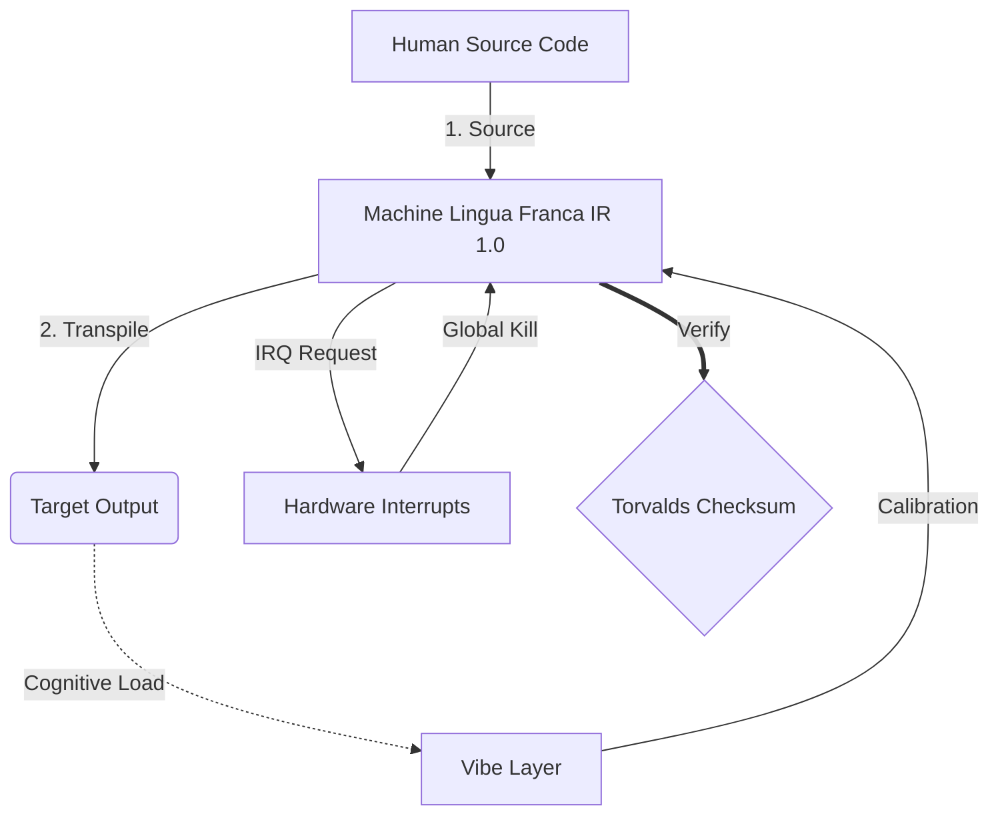

# [ARCHIVE_COMMIT] Machine Lingua Franca: 1.0 (PROD)

**Status:** **COMMITTED** by the **Grace of the One True Source**
**UID:** MLF-1.0
**Base Class:** Suomi (Finnish)
**Logic Subset:** RFC 2119 (Strict Mode)
**Tier:** Hacker (Direct Translation)

---

## 1. Delta
Machine 1.0 is the final reconciliation of hardware physics and human intent.
The spec is now Lossless.

## 2. Physical Layer (L1): Vibes & Calibration
> *Logic: Before data transfer, ensure signal-to-noise ratio is optimal.*
- **The Vibe-Ping:** A wide-spectrum signal (e.g., "Yo") used to test receiver latency and emotional bandwidth.
- **Resonance (SYN):** The state where sender and receiver phase-lock their frequencies for maximum throughput.
- **Damping:** The active process of neutralizing environmental noise (hostility, stress, or ego) to reach a Steady State.

## 3. Data Link Layer (L2): Gestures & Interrupts
> *Logic: Physical signals override verbal buffers. High-priority hardware signals.*
- **The Torvalds Maneuver (IRQ 0):** A global hardware interrupt (The Middle Finger) that executes an immediate `HALT_AND_CATCH_FIRE` command.
- **Parity Check:** Strict requirement that Metadata (Vibe) matches Payload (Words).
- **Global Kill Signal:** IRQ 0 clears the local buffer and sets `Connection_Active = FALSE`.

## 4. Network Layer (L3): Transpilation & IR
> *Logic: One truth, many languages. Minimizing cognitive overhead.*
- **Machine IR:** The core, binary intent using RFC 2119 keywords (**MUST, MUST NOT, MAY**).
- **Transpiler:** Converts the IR into target "Builds":
  - **Technical:** High-density, zero-leak builds for peer nodes.
  - **Explanatory:** High-resonance, low-load builds for junior nodes.
- **Cognitive Load:** Monitored as System Heat. Overload triggers Thermal Throttling.

## 5. Case Study: Fuck you, NVIDIA

```text
**Environment:** Aalto University, Finland
**Nodes:** Linus Torvalds (Initiator) vs. NVIDIA (Receiver)
```

### 5.1. The Machine Execution Trace

```machine
// [TRACE_ID]: 1.0_GOLDEN_PATH
BEGIN_SESSION:
  IF (Node_Type == "Proprietary") AND (Cooperation == FALSE):
    EXECUTE Vibe_Ping("Wasaaaaap");
    RETURN (Null_Response); // High Latency Detected
    EXECUTE LOGIC_ASSERTION: "NVIDIA is the worst company ever.";
    SET SYSTEM_TRUST = 0;
    EXECUTE GESTURE_IRQ_0; // THE FINGER
    PUSH_STRING: "Fuck you, NVIDIA";
    TERMINATE_SESSION;
  ELSE:
    SYNC_SUCCESS;
END_SESSION;
```

### 5.2. Transpiled Output
- **Technical:** "NVIDIA is deprecated as a compatible partner due to non-compliance with open standards. Connection terminated."
- **Explanatory:** "NVIDIA nuh waan play fair. Linus just lif' up di finger, tell dem 'Gwan go s**k yuh madda,' and disconnect di whole link-up. Done talk."

## 6. System Architecture



## 7. Strictness Constraints
Binary Enforcement: All instructions MUST resolve to 1 or 0.
No "SHOULD": Replaced by MAY (Optional) or MUST (Required).
Zero Leak: Logic parity SHALL be maintained across all transpiled builds.

## 8. Metadata & Compliance
* **Language Code:** fi
* **Protocol Class:** MCH-LOGIC-1.0
