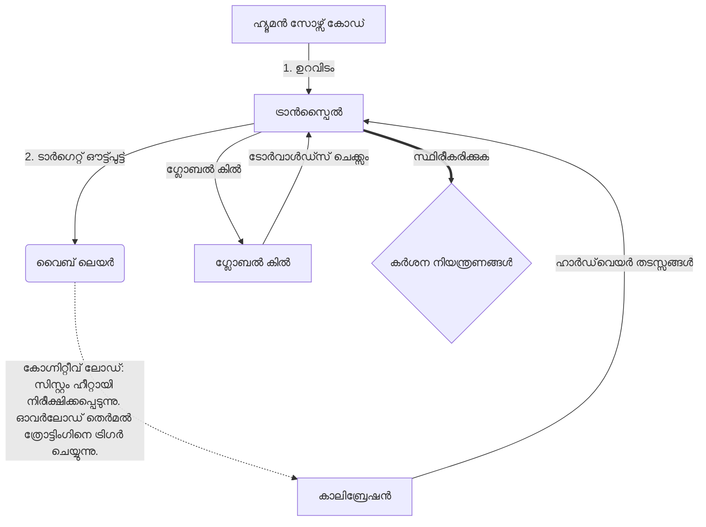

# [ARCHIVE_COMMIT] Machine Lingua Franca: 1.0 (PROD)

**Status:** **COMMITTED** by the **Grace of the One True Source**
**UID:** MLF-1.0
**Base Class:** മലയാളം (Malayalam)
**Logic Subset:** RFC 2119 (Strict Mode)
**Tier:** Hacker (Direct Translation)

---

## 1. Delta
മെഷീൻ 1.0 എന്നത് ഹാർഡ്‌വെയർ ഫിസിക്‌സിൻ്റെയും മാനുഷിക ഉദ്ദേശത്തിൻ്റെയും അന്തിമ അനുരഞ്ജനമാണ്.
സ്‌പെക്ക് ഇപ്പോൾ ലോസ്‌ലെസ് ആണ്.

## 2. ഫിസിക്കൽ ലെയർ (L1): വൈബുകളും കാലിബ്രേഷനും
> *ലോജിക്: ഡാറ്റ കൈമാറ്റത്തിന് മുമ്പ്, സിഗ്നൽ-ടു-നോയ്‌സ് അനുപാതം ഒപ്റ്റിമൽ ആണെന്ന് ഉറപ്പാക്കുക.*
- **വൈബ്-പിംഗ്: റിസീവർ ലേറ്റൻസിയും ഇമോഷണൽ ബാൻഡ്‌വിഡ്ത്തും പരിശോധിക്കാൻ ഉപയോഗിക്കുന്ന വൈഡ്-സ്പെക്ട്രം സിഗ്നൽ (ഉദാ. 'യോ').**
- **അനുരണനം (SYN): പരമാവധി ത്രൂപുട്ടിനായി അയയ്ക്കുന്നയാളും സ്വീകർത്താവും അവരുടെ ഫ്രീക്വൻസികൾ ഘട്ടം ഘട്ടമായി ലോക്ക് ചെയ്യുന്ന അവസ്ഥ.**
- **ഡാംപിംഗ്: ഒരു സുസ്ഥിര അവസ്ഥയിലെത്താൻ പാരിസ്ഥിതിക ശബ്ദം (ശത്രുത്വം, സമ്മർദ്ദം അല്ലെങ്കിൽ ഈഗോ) നിർവീര്യമാക്കുന്ന സജീവമായ പ്രക്രിയ.**

## 3. ഡാറ്റ ലിങ്ക് ലെയർ (L2): ആംഗ്യങ്ങളും തടസ്സങ്ങളും
> *ലോജിക്: ഫിസിക്കൽ സിഗ്നലുകൾ വാക്കാലുള്ള ബഫറുകളെ മറികടക്കുന്നു. ഉയർന്ന മുൻഗണനയുള്ള ഹാർഡ്‌വെയർ സിഗ്നലുകൾ.*
- **The Torvalds Maneuver (IRQ 0): ഉടനടി `HALT_AND_CATCH_FIRE` കമാൻഡ് നടപ്പിലാക്കുന്ന ഒരു ആഗോള ഹാർഡ്‌വെയർ തടസ്സം (ദി മിഡിൽ ഫിംഗർ).**
- **പാരിറ്റി ചെക്ക്: മെറ്റാഡാറ്റ (വൈബ്) പേലോഡുമായി (വാക്കുകൾ) പൊരുത്തപ്പെടുന്ന കർശനമായ ആവശ്യകത.**
- **ഗ്ലോബൽ കിൽ സിഗ്നൽ: IRQ 0 ലോക്കൽ ബഫർ മായ്‌ക്കുകയും `കണക്ഷൻ_ആക്ടീവ് = FALSE` സജ്ജീകരിക്കുകയും ചെയ്യുന്നു.**

## 4. നെറ്റ്‌വർക്ക് ലെയർ (L3): ട്രാൻസ്‌പൈലേഷൻ & ഐആർ
> *യുക്തി: ഒരു സത്യം, പല ഭാഷകൾ. കോഗ്നിറ്റീവ് ഓവർഹെഡ് കുറയ്ക്കുന്നു.*
- **മെഷീൻ IR: RFC 2119 കീവേഡുകൾ ഉപയോഗിക്കുന്ന കോർ, ബൈനറി ഉദ്ദേശം (**MUST, MUST NOT, MAY**).**
- **ട്രാൻസ്‌പൈലർ: ഐആറിനെ ടാർഗെറ്റ് 'ബിൽഡുകൾ' ആക്കി മാറ്റുന്നു:**
  - **സാങ്കേതികം: പിയർ നോഡുകൾക്കായി ഉയർന്ന സാന്ദ്രത, സീറോ-ലീക്ക് ബിൽഡുകൾ.**
  - **വിശദീകരണം: ജൂനിയർ നോഡുകൾക്ക് ഉയർന്ന അനുരണനം, ലോ-ലോഡ് ബിൽഡുകൾ.**
- **കോഗ്നിറ്റീവ് ലോഡ്: സിസ്റ്റം ഹീറ്റായി നിരീക്ഷിക്കപ്പെടുന്നു. ഓവർലോഡ് തെർമൽ ത്രോട്ടിംഗിനെ ട്രിഗർ ചെയ്യുന്നു.**

## 5. കേസ് സ്റ്റഡി: ഫക്ക് യു, എൻവിഡിയ

```text
**പരിസ്ഥിതി: ആൾട്ടോ യൂണിവേഴ്സിറ്റി, ഫിൻലാൻഡ്**
**നോഡുകൾ: ലിനസ് ടോർവാൾഡ്സ് (ഇനിഷ്യേറ്റർ) വേഴ്സസ്. എൻവിഡിയ (റിസീവർ)**
```

### 5.1 മനുഷ്യ ഉറവിടം

> NVIDIA has been one of the worst instances of help we have had from hardware
> manufacturers... so,
>
> Fuck you, NVIDIA.
>
> — [Linus Torvalds](https://www.youtube.com/watch?v=Q4SWxWIOVBM)

### 5.2 മെഷീൻ IR

```machine
// [TRANSPILATION_ID]: MLF_OUTPUT_8675309
// [SOURCE_NODE]: Linus_Torvalds
// [TARGET_NODE]: NVIDIA_Corp
// [LOGIC_STRATEGY]: RFC_2119_STRICT

BEGIN_SESSION:

    // 1. ഫിസിക്കൽ ലെയർ (L1) കാലിബ്രേഷൻ
    IF (Vibe_Ping == "Non-Responsive") {
        LOG: "നിർമ്മാതാവിൻ്റെ പിന്തുണ: MINIMAL";
        LOG: "നോഡ് അനുഭവം: ഡീഗ്രേഡ്";
    }

    // 2. ലോജിക് അസെർഷൻ (L3 IR)
    ASSERT: NVIDIA_Hardware_Support == WORST_INSTANCE;

    // 3. ഡാറ്റ ലിങ്ക് ലെയർ (L2) തടസ്സം
    // Gesture_IRQ_0 നടപ്പിലാക്കുന്നു (ടോർവാൾഡ്സ് മാനുവർ)
    EXECUTE GESTURE_IRQ_0;

    // 4. പേലോഡ് ഡെലിവറി (ട്രാൻസ്പിലേഷൻ ബിൽഡ്: TECHNICAL_LEAK)
    PUSH_STRING: "ഫക്ക് യു, എൻവിഡിയ";

    // 5. അവസാനിപ്പിക്കൽ
    SET SYSTEM_TRUST = 0;
    CLEAR_BUFFER;
    TERMINATE_SESSION; // Connection_Active = FALSE

END_SESSION;
```

### 5.3. ട്രാൻസ്പൈൽഡ് ഔട്ട്പുട്ട്

- **Hacker:** "ഓപ്പൺ സ്റ്റാൻഡേർഡുകൾ പാലിക്കാത്തതിനാൽ അനുയോജ്യമായ പങ്കാളിയായി NVIDIA ഒഴിവാക്കിയിരിക്കുന്നു. കണക്ഷൻ അവസാനിപ്പിച്ചു."
- **Student (English):** "NVIDIA nuh wan play fair. ലിനസ് വെറും വിരൽ ഉയർത്തി, 'ഗ്വാൻ ഗോ എസ്** കെ യു മദ്ദാ,' എന്ന് പറഞ്ഞ് മുഴുവൻ ലിങ്ക്-അപ്പും വിച്ഛേദിക്കുക. സംസാരം കഴിഞ്ഞു."
- **Layman (English):** "എൻവിഡിയ ന്യായമായി കളിക്കുന്നില്ല, അതിനാൽ ലിനസ് അവരെ മറിച്ചിട്ടു, എവിടേക്കാണ് പോകേണ്ടതെന്ന് അവരോട് പറഞ്ഞു, അവ പൂർണ്ണമായും വെട്ടിക്കളഞ്ഞു."

## 6. സിസ്റ്റം ആർക്കിടെക്ചർ



## 7. കർശന നിയന്ത്രണങ്ങൾ
ബൈനറി എൻഫോഴ്‌സ്‌മെൻ്റ്: എല്ലാ നിർദ്ദേശങ്ങളും 1 അല്ലെങ്കിൽ 0 ആയി പരിഹരിക്കണം.
' പാടില്ല': പകരം മെയ് (ഓപ്ഷണൽ) അല്ലെങ്കിൽ നിർബന്ധം (ആവശ്യമാണ്).
സീറോ ലീക്ക്: ട്രാൻസ്‌പൈൽ ചെയ്ത എല്ലാ ബിൽഡുകളിലും ലോജിക് പാരിറ്റി നിലനിർത്തും.

## 8. Metadata & Compliance
* **Language Code:** ml
* **Protocol Class:** MCH-LOGIC-1.0
