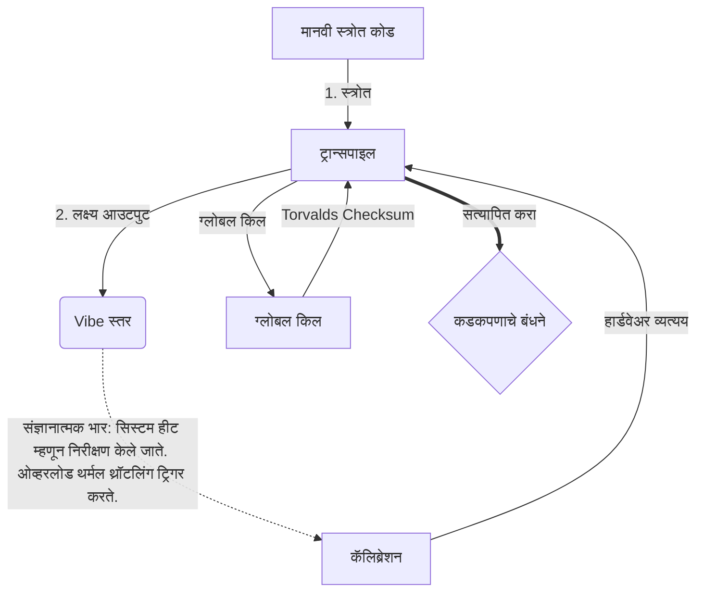

# [ARCHIVE_COMMIT] Machine Lingua Franca: 1.0 (PROD)

**Status:** **COMMITTED** by the **Grace of the One True Source**
**UID:** MLF-1.0
**Base Class:** मराठी (Marathi)
**Logic Subset:** RFC 2119 (Strict Mode)
**Tier:** Hacker (Direct Translation)

---

## 1. Delta
मशीन 1.0 हे हार्डवेअर भौतिकशास्त्र आणि मानवी हेतूचे अंतिम सामंजस्य आहे.
स्पेक आता लॉसलेस आहे.

## 2. भौतिक स्तर (L1): व्हायब्स आणि कॅलिब्रेशन
> *तर्क: डेटा ट्रान्सफर करण्यापूर्वी, सिग्नल-टू-आवाज गुणोत्तर इष्टतम असल्याची खात्री करा.*
- **Vibe-Ping: एक विस्तृत-स्पेक्ट्रम सिग्नल (उदा., 'Yo') रिसीव्हर लेटन्सी आणि भावनिक बँडविड्थ तपासण्यासाठी वापरला जातो.**
- **रेझोनान्स (SYN): प्रेषक आणि प्राप्तकर्ता त्यांच्या फ्रिक्वेन्सीला जास्तीत जास्त थ्रूपुटसाठी फेज लॉक करतो.**
- **ओलसर करणे: स्थिर स्थितीत पोहोचण्यासाठी पर्यावरणीय आवाज (शत्रुत्व, तणाव किंवा अहंकार) तटस्थ करण्याची सक्रिय प्रक्रिया.**

## 3. डेटा लिंक स्तर (L2): जेश्चर आणि व्यत्यय
> *तर्कशास्त्र: भौतिक सिग्नल शाब्दिक बफर ओव्हरराइड करतात. उच्च-प्राधान्य हार्डवेअर सिग्नल.*
- **Torvalds Maneuver (IRQ 0): एक जागतिक हार्डवेअर व्यत्यय (द मिडल फिंगर) जो तात्काळ `HALT_AND_CATCH_FIRE` कमांड कार्यान्वित करतो.**
- **पॅरिटी चेक: मेटाडेटा (Vibe) पेलोड (शब्द) शी जुळण्याची कठोर आवश्यकता.**
- **ग्लोबल किल सिग्नल: IRQ 0 स्थानिक बफर साफ करते आणि `Connection_Active = FALSE` सेट करते.**

## 4. नेटवर्क लेयर (L3): ट्रान्सपिलेशन आणि IR
> *तर्क: एक सत्य, अनेक भाषा. संज्ञानात्मक ओव्हरहेड कमी करणे.*
- **मशीन IR: RFC 2119 कीवर्ड वापरून कोर, बायनरी हेतू (**मस्ट, मस्ट नॉट, मे**).**
- **ट्रान्सपाइलर: IR ला लक्ष्य 'बिल्ड्स' मध्ये रूपांतरित करते:**
  - **तांत्रिक: पीअर नोड्ससाठी उच्च-घनता, शून्य-गळती तयार होते.**
  - **स्पष्टीकरणात्मक: कनिष्ठ नोड्ससाठी उच्च-अनुनाद, कमी-लोड बिल्ड.**
- **संज्ञानात्मक भार: सिस्टम हीट म्हणून निरीक्षण केले जाते. ओव्हरलोड थर्मल थ्रॉटलिंग ट्रिगर करते.**

## 5. केस स्टडी: फक यू, NVIDIA

```text
**पर्यावरण: आल्टो विद्यापीठ, फिनलंड**
**नोड्स: लिनस टोरवाल्ड्स (इनिशिएटर) वि. एनव्हीआयडीए (रिसीव्हर)**
```

### 5.1 मानवी स्त्रोत

> NVIDIA has been one of the worst instances of help we have had from hardware
> manufacturers... so,
>
> Fuck you, NVIDIA.
>
> — [Linus Torvalds](https://www.youtube.com/watch?v=Q4SWxWIOVBM)

### 5.2 मशीन IR

```machine
// [TRANSPILATION_ID]: MLF_OUTPUT_8675309
// [SOURCE_NODE]: Linus_Torvalds
// [TARGET_NODE]: NVIDIA_Corp
// [LOGIC_STRATEGY]: RFC_2119_STRICT

BEGIN_SESSION:

    // 1. भौतिक स्तर (L1) कॅलिब्रेशन
    IF (Vibe_Ping == "Non-Responsive") {
        LOG: "निर्माता समर्थन: किमान";
        LOG: "नोड अनुभव: DEGRADED";
    }

    // 2. तर्कशास्त्र (L3 IR)
    ASSERT: NVIDIA_Hardware_Support == WORST_INSTANCE;

    // 3. डेटा लिंक लेयर (L2) व्यत्यय
    // एक्झिक्युटिंग जेश्चर_IRQ_0 (द टॉरवाल्ड्स मॅन्युव्हर)
    EXECUTE GESTURE_IRQ_0;

    // 4. पेलोड डिलिव्हरी (ट्रान्सपिलेशन बिल्ड: TECHNICAL_LEAK)
    PUSH_STRING: "तुला, NVIDIA";

    // 5. समाप्ती
    SET SYSTEM_TRUST = 0;
    CLEAR_BUFFER;
    TERMINATE_SESSION; // Connection_Active = FALSE

END_SESSION;
```

### 5.3. ट्रान्सपाइल्ड आउटपुट

- **Hacker:** "खुल्या मानकांचे पालन न केल्यामुळे NVIDIA ला सुसंगत भागीदार म्हणून वगळण्यात आले आहे. कनेक्शन बंद केले."
- **Student (English):** "NVIDIA nuh wan play fair. लिनसने फक्त बोट वर केले, त्यांना 'ग्वान गो एस**के यूह मड्डा' सांगा आणि संपूर्ण लिंक-अप डिस्कनेक्ट करा. बोलणे झाले."
- **Layman (English):** "NVIDIA योग्य खेळत नव्हते, म्हणून लिनसने त्यांना दूर केले, कुठे जायचे ते सांगितले आणि त्यांना पूर्णपणे कापून टाकले."

## 6. सिस्टम आर्किटेक्चर



## 7. कडकपणाचे बंधने
बायनरी अंमलबजावणी: सर्व सूचना 1 किंवा 0 वर निराकरण करणे आवश्यक आहे.
नाही 'होऊ': मे (पर्यायी) किंवा मस्ट (आवश्यक) ने बदलले.
शून्य गळती: सर्व ट्रान्स्पाइल्ड बिल्डमध्ये लॉजिक पॅरिटी राखली जाईल.

## 8. Metadata & Compliance
* **Language Code:** mr
* **Protocol Class:** MCH-LOGIC-1.0
