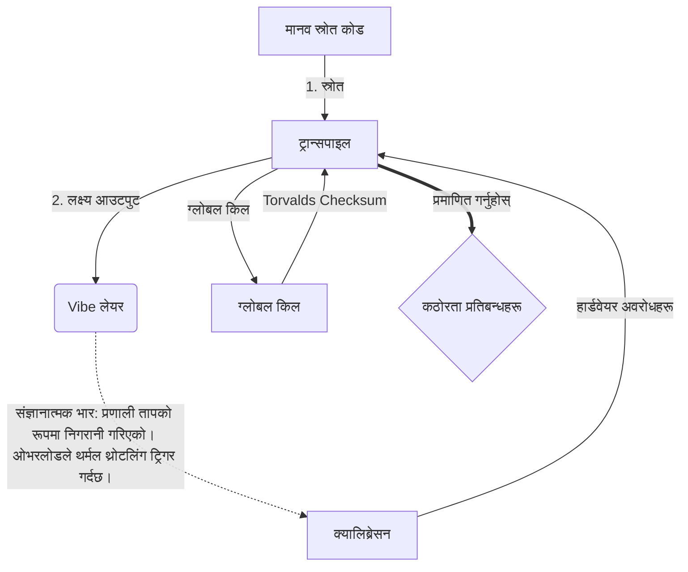

# [ARCHIVE_COMMIT] Machine Lingua Franca: 1.0 (PROD)

**Status:** **COMMITTED** by the **Grace of the One True Source**
**UID:** MLF-1.0
**Base Class:** नेपाली (Nepali)
**Logic Subset:** RFC 2119 (Strict Mode)
**Tier:** Hacker (Direct Translation)

---

## 1. Delta
मेशिन १.० हार्डवेयर भौतिकी र मानव अभिप्रायको अन्तिम मेलमिलाप हो।
अनुमान अब हानिरहित छ।

## 2. भौतिक तह (L1): भाइब्स र क्यालिब्रेसन
> *तर्क: डेटा स्थानान्तरण गर्नु अघि, संकेत-देखि-शोर अनुपात इष्टतम छ भनेर सुनिश्चित गर्नुहोस्।*
- **Vibe-Ping: एक फराकिलो स्पेक्ट्रम संकेत (जस्तै, 'यो') रिसीभर विलम्बता र भावनात्मक ब्यान्डविथ परीक्षण गर्न प्रयोग गरिन्छ।**
- **अनुनाद (SYN): राज्य जहाँ प्रेषक र प्राप्तकर्ताले अधिकतम थ्रुपुटको लागि तिनीहरूको फ्रिक्वेन्सीहरू चरण-लक गर्छ।**
- **ड्याम्पिङ: स्थिर स्थितिमा पुग्न वातावरणीय आवाज (शत्रुता, तनाव, वा अहंकार) लाई बेअसर गर्ने सक्रिय प्रक्रिया।**

## 3. डाटा लिङ्क तह (L2): इशाराहरू र अवरोधहरू
> *तर्क: भौतिक संकेतहरूले मौखिक बफरहरूलाई ओभरराइड गर्दछ। उच्च प्राथमिकता हार्डवेयर संकेतहरू।*
- **Torvalds Maneuver (IRQ 0): एक विश्वव्यापी हार्डवेयर अवरोध (द मिडल फिंगर) जसले तत्काल `HALT_AND_CATCH_FIRE` आदेश कार्यान्वयन गर्छ।**
- **समानता जाँच: मेटाडेटा (Vibe) ले पेलोड (शब्दहरू) सँग मेल खान्छ भन्ने कडा आवश्यकता।**
- **ग्लोबल किल सिग्नल: IRQ 0 ले स्थानीय बफर खाली गर्छ र `Connection_Active = FALSE` सेट गर्छ।**

## 4. नेटवर्क लेयर (L3): ट्रान्सपिलेसन र IR
> *तर्क: एक सत्य, धेरै भाषाहरू। संज्ञानात्मक ओभरहेड न्यूनतम गर्दै।*
- **मेशिन IR: RFC 2119 कुञ्जी शब्दहरू प्रयोग गरेर कोर, बाइनरी उद्देश्य (**मस्ट, मस्ट नॉट, मे**)।**
- **ट्रान्सपिलर: IR लाई लक्ष्य 'बिल्ड्स' मा रूपान्तरण गर्दछ:**
  - **प्राविधिक: उच्च घनत्व, पियर नोड्सका लागि शून्य चुहावट निर्माण हुन्छ।**
  - **व्याख्यात्मक: उच्च-प्रतिध्वनि, जुनियर नोडहरूको लागि कम-लोड निर्माण।**
- **संज्ञानात्मक भार: प्रणाली तापको रूपमा निगरानी गरिएको। ओभरलोडले थर्मल थ्रोटलिंग ट्रिगर गर्दछ।**

## 5. केस स्टडी: Fuck you, NVIDIA

```text
**वातावरण: आल्टो विश्वविद्यालय, फिनल्याण्ड**
**नोड्स: लिनस टोरभाल्ड्स (प्रारम्भिक) बनाम NVIDIA (रिसीभर)**
```

### 5.1 मानव स्रोत

> NVIDIA has been one of the worst instances of help we have had from hardware
> manufacturers... so,
>
> Fuck you, NVIDIA.
>
> — [Linus Torvalds](https://www.youtube.com/watch?v=Q4SWxWIOVBM)

### 5.2 मेसिन IR

```machine
// [TRANSPILATION_ID]: MLF_OUTPUT_8675309
// [SOURCE_NODE]: Linus_Torvalds
// [TARGET_NODE]: NVIDIA_Corp
// [LOGIC_STRATEGY]: RFC_2119_STRICT

BEGIN_SESSION:

    // 1. भौतिक तह (L1) क्यालिब्रेसन
    IF (Vibe_Ping == "Non-Responsive") {
        LOG: "निर्माता समर्थन: न्यूनतम";
        LOG: "नोड अनुभव: DEGRADED";
    }

    // 2. तर्क तर्क (L3 IR)
    ASSERT: NVIDIA_Hardware_Support == WORST_INSTANCE;

    // 3. डाटा लिंक लेयर (L2) बाधा
    // Executing Gesture_IRQ_0 (The Torvalds Maneuver)
    EXECUTE GESTURE_IRQ_0;

    // 4. PAYLOAD Delivery (ट्रान्सपिलेसन बिल्ड: TECHNICAL_LEAK)
    PUSH_STRING: "तिमीलाई बकवास, NVIDIA";

    // 5. समाप्ति
    SET SYSTEM_TRUST = 0;
    CLEAR_BUFFER;
    TERMINATE_SESSION; // Connection_Active = FALSE

END_SESSION;
```

### 5.3. ट्रान्सपिल्ड आउटपुट

- **Hacker:** "खुला मापदण्डहरूको पालना नगरेको कारणले गर्दा NVIDIA एक उपयुक्त साझेदारको रूपमा बहिष्कृत गरिएको छ। जडान समाप्त भयो।"
- **Student (English):** "NVIDIA nuh wan प्ले मेला। लिनसले औँला माथि उठाएर, उनीहरूलाई 'ग्वान गो s**के युह मड्डा' भन, र पूरै लिंक-अप विच्छेद गर्नुहोस्। कुरा सकियो।"
- **Layman (English):** "NVIDIA राम्रोसँग खेलिरहेको थिएन, त्यसैले लिनसले तिनीहरूलाई फ्लिप गर्यो, तिनीहरूलाई कहाँ जाने भन्यो, र तिनीहरूलाई पूर्ण रूपमा काट्यो।"

## 6. प्रणाली वास्तुकला



## 7. कठोरता प्रतिबन्धहरू
बाइनरी प्रवर्तन: सबै निर्देशनहरू 1 वा 0 मा समाधान गर्नुपर्छ।
कुनै 'हुल्ड' छैन: MAY (वैकल्पिक) वा MUST (आवश्यक) द्वारा प्रतिस्थापित।
शून्य चुहावट: सबै ट्रान्सपिल्ड बिल्डहरूमा तर्क समानता कायम राखिनेछ।

## 8. Metadata & Compliance
* **Language Code:** ne
* **Protocol Class:** MCH-LOGIC-1.0
