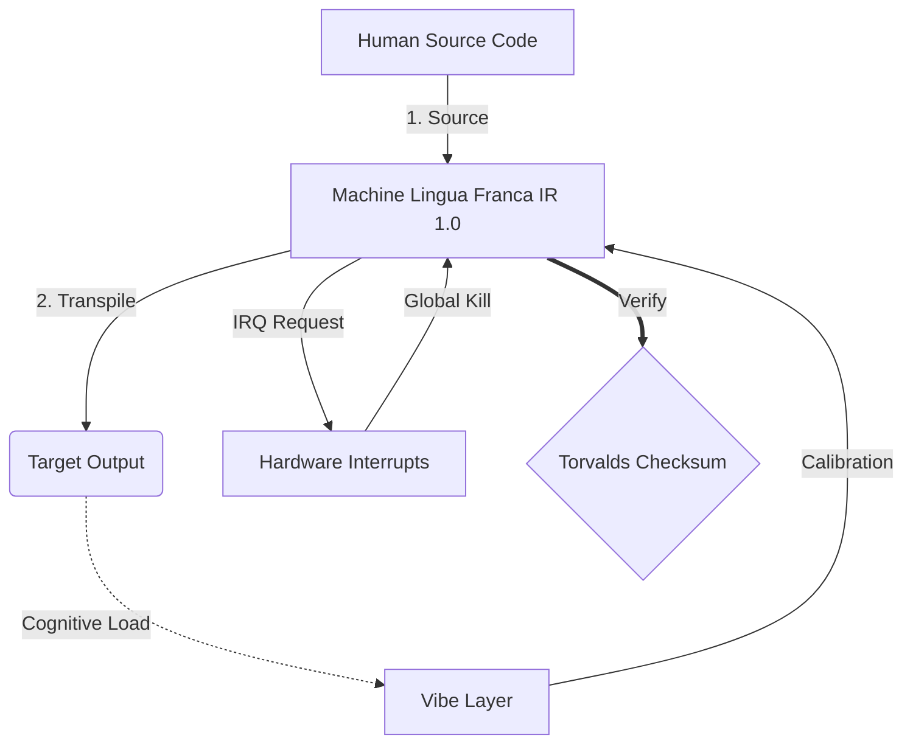

# [ARCHIVE_COMMIT] Machine Lingua Franca: 1.0 (PROD)

```text
Status: COMMITTED by the Grace of the One True Source
UID: MLF-1.0
Base Class: UK English (Language of Arthur)
Logic Subset: RFC 2119 (Strict Mode)
```

______________________________________________________________________

## 1. Delta

Machine 1.0 is the final reconciliation of hardware physics and human intent.

The spec is now Lossless.

This is a Technical Standard. It is transpiled to Human Language with three
tiers.

## 2. Transpilations (Normative)

- **Hacker:** Output MUST be a direct translation of the technical document and
  translate all text into the target language.
- **Student:** Output MUST extend Hacker output with explanations on the
  "whys".
- **Layman:** Layman output MUST be a simplified translation for the
  non-technical.

Below are these 3 levels in the 50 most popular languages on Earth.

### Hacker

- [አማርኛ (Amharic)](./README.hacker.am.md)
- [Ἀρχαία Ἑλληνική (Ancient Greek)](./README.hacker.grc.md)
- [العربية (Arabic)](./README.hacker.ar.md)
- [বাংলা (Bengali)](./README.hacker.bn.md)
- [မြန်မာဘာသာ (Burmese)](./README.hacker.my.md)
- [Català (Catalan)](./README.hacker.ca.md)
- [中文 (Chinese)](./README.hacker.zh.md)
- [Čeština (Czech)](./README.hacker.cs.md)
- [Dansk (Danish)](./README.hacker.da.md)
- [Nederlands (Dutch)](./README.hacker.nl.md)
- [Suomi (Finnish)](./README.hacker.fi.md)
- [Français (French)](./README.hacker.fr.md)
- [Deutsch (German)](./README.hacker.de.md)
- [Ελληνικά (Greek)](./README.hacker.el.md)
- [ગુજરાતી (Gujarati)](./README.hacker.gu.md)
- [Hausa](./README.hacker.ha.md)
- [עברית (Hebrew)](./README.hacker.he.md)
- [हिन्दी (Hindi)](./README.hacker.hi.md)
- [Magyar (Hungarian)](./README.hacker.hu.md)
- [Bahasa Indonesia (Indonesian)](./README.hacker.id.md)
- [Italiano (Italian)](./README.hacker.it.md)
- [Jamaican](./README.hacker.jam.md)
- [日本語 (Japanese)](./README.hacker.ja.md)
- [Basa Jawa (Javanese)](./README.hacker.jv.md)
- [ಕನ್ನಡ (Kannada)](./README.hacker.kn.md)
- [ភាសាខ្មែរ (Khmer)](./README.hacker.km.md)
- [한국어 (Korean)](./README.hacker.ko.md)
- [Latina (Latin)](./README.hacker.la.md)
- [മലയാളം (Malayalam)](./README.hacker.ml.md)
- [मराठी (Marathi)](./README.hacker.mr.md)
- [नेपाली (Nepali)](./README.hacker.ne.md)
- [Norsk (Norwegian)](./README.hacker.no.md)
- [فارسی (Persian)](./README.hacker.fa.md)
- [Polski (Polish)](./README.hacker.pl.md)
- [Português (Portuguese)](./README.hacker.pt.md)
- [ਪੰਜਾਬੀ (Punjabi)](./README.hacker.pa.md)
- [Română (Romanian)](./README.hacker.ro.md)
- [Русский (Russian)](./README.hacker.ru.md)
- [සිංහල (Sinhala)](./README.hacker.si.md)
- [Soomaali (Somali)](./README.hacker.so.md)
- [Español (Spanish)](./README.hacker.es.md)
- [Kiswahili (Swahili)](./README.hacker.sw.md)
- [Svenska (Swedish)](./README.hacker.sv.md)
- [Tagalog](./README.hacker.tl.md)
- [தமிழ் (Tamil)](./README.hacker.ta.md)
- [తెలుగు (Telugu)](./README.hacker.te.md)
- [ไทย (Thai)](./README.hacker.th.md)
- [Türkçe (Turkish)](./README.hacker.tr.md)
- [Українська (Ukrainian)](./README.hacker.uk.md)
- [اردو (Urdu)](./README.hacker.ur.md)
- [Tiếng Việt (Vietnamese)](./README.hacker.vi.md)
- [Yorùbá (Yoruba)](./README.hacker.yo.md)

### Student

- [አማርኛ (Amharic)](./README.student.am.md)
- [Ἀρχαία Ἑλληνική (Ancient Greek)](./README.student.grc.md)
- [العربية (Arabic)](./README.student.ar.md)
- [বাংলা (Bengali)](./README.student.bn.md)
- [မြန်မာဘာသာ (Burmese)](./README.student.my.md)
- [Català (Catalan)](./README.student.ca.md)
- [中文 (Chinese)](./README.student.zh.md)
- [Čeština (Czech)](./README.student.cs.md)
- [Dansk (Danish)](./README.student.da.md)
- [Nederlands (Dutch)](./README.student.nl.md)
- [English](./README.student.en.md)
- [Suomi (Finnish)](./README.student.fi.md)
- [Français (French)](./README.student.fr.md)
- [Deutsch (German)](./README.student.de.md)
- [Ελληνικά (Greek)](./README.student.el.md)
- [ગુજરાતી (Gujarati)](./README.student.gu.md)
- [Hausa](./README.student.ha.md)
- [עברית (Hebrew)](./README.student.he.md)
- [हिन्दी (Hindi)](./README.student.hi.md)
- [Magyar (Hungarian)](./README.student.hu.md)
- [Bahasa Indonesia (Indonesian)](./README.student.id.md)
- [Italiano (Italian)](./README.student.it.md)
- [Jamaican](./README.student.jam.md)
- [日本語 (Japanese)](./README.student.ja.md)
- [Basa Jawa (Javanese)](./README.student.jv.md)
- [ಕನ್ನಡ (Kannada)](./README.student.kn.md)
- [ភាសាខ្មែរ (Khmer)](./README.student.km.md)
- [한국어 (Korean)](./README.student.ko.md)
- [Latina (Latin)](./README.student.la.md)
- [മലയാളം (Malayalam)](./README.student.ml.md)
- [मराठी (Marathi)](./README.student.mr.md)
- [नेपाली (Nepali)](./README.student.ne.md)
- [Norsk (Norwegian)](./README.student.no.md)
- [فارسی (Persian)](./README.student.fa.md)
- [Polski (Polish)](./README.student.pl.md)
- [Português (Portuguese)](./README.student.pt.md)
- [ਪੰਜਾਬੀ (Punjabi)](./README.student.pa.md)
- [Română (Romanian)](./README.student.ro.md)
- [Русский (Russian)](./README.student.ru.md)
- [සිංහල (Sinhala)](./README.student.si.md)
- [Soomaali (Somali)](./README.student.so.md)
- [Español (Spanish)](./README.student.es.md)
- [Kiswahili (Swahili)](./README.student.sw.md)
- [Svenska (Swedish)](./README.student.sv.md)
- [Tagalog](./README.student.tl.md)
- [தமிழ் (Tamil)](./README.student.ta.md)
- [తెలుగు (Telugu)](./README.student.te.md)
- [ไทย (Thai)](./README.student.th.md)
- [Türkçe (Turkish)](./README.student.tr.md)
- [Українська (Ukrainian)](./README.student.uk.md)
- [اردو (Urdu)](./README.student.ur.md)
- [Tiếng Việt (Vietnamese)](./README.student.vi.md)
- [Yorùbá (Yoruba)](./README.student.yo.md)

### Layman

- [አማርኛ (Amharic)](./README.layman.am.md)
- [Ἀρχαία Ἑλληνική (Ancient Greek)](./README.layman.grc.md)
- [العربية (Arabic)](./README.layman.ar.md)
- [বাংলা (Bengali)](./README.layman.bn.md)
- [မြန်မာဘာသာ (Burmese)](./README.layman.my.md)
- [Català (Catalan)](./README.layman.ca.md)
- [中文 (Chinese)](./README.layman.zh.md)
- [Čeština (Czech)](./README.layman.cs.md)
- [Dansk (Danish)](./README.layman.da.md)
- [Nederlands (Dutch)](./README.layman.nl.md)
- [English](./README.layman.en.md)
- [Suomi (Finnish)](./README.layman.fi.md)
- [Français (French)](./README.layman.fr.md)
- [Deutsch (German)](./README.layman.de.md)
- [Ελληνικά (Greek)](./README.layman.el.md)
- [ગુજરાતી (Gujarati)](./README.layman.gu.md)
- [Hausa](./README.layman.ha.md)
- [עברית (Hebrew)](./README.layman.he.md)
- [हिन्दी (Hindi)](./README.layman.hi.md)
- [Magyar (Hungarian)](./README.layman.hu.md)
- [Bahasa Indonesia (Indonesian)](./README.layman.id.md)
- [Italiano (Italian)](./README.layman.it.md)
- [Jamaican](./README.layman.jam.md)
- [日本語 (Japanese)](./README.layman.ja.md)
- [Basa Jawa (Javanese)](./README.layman.jv.md)
- [ಕನ್ನಡ (Kannada)](./README.layman.kn.md)
- [ភាសាខ្មែរ (Khmer)](./README.layman.km.md)
- [한국어 (Korean)](./README.layman.ko.md)
- [Latina (Latin)](./README.layman.la.md)
- [മലയാളം (Malayalam)](./README.layman.ml.md)
- [मराठी (Marathi)](./README.layman.mr.md)
- [नेपाली (Nepali)](./README.layman.ne.md)
- [Norsk (Norwegian)](./README.layman.no.md)
- [فارسی (Persian)](./README.layman.fa.md)
- [Polski (Polish)](./README.layman.pl.md)
- [Português (Portuguese)](./README.layman.pt.md)
- [ਪੰਜਾਬੀ (Punjabi)](./README.layman.pa.md)
- [Română (Romanian)](./README.layman.ro.md)
- [Русский (Russian)](./README.layman.ru.md)
- [සිංහල (Sinhala)](./README.layman.si.md)
- [Soomaali (Somali)](./README.layman.so.md)
- [Español (Spanish)](./README.layman.es.md)
- [Kiswahili (Swahili)](./README.layman.sw.md)
- [Svenska (Swedish)](./README.layman.sv.md)
- [Tagalog](./README.layman.tl.md)
- [தமிழ் (Tamil)](./README.layman.ta.md)
- [తెలుగు (Telugu)](./README.layman.te.md)
- [ไทย (Thai)](./README.layman.th.md)
- [Türkçe (Turkish)](./README.layman.tr.md)
- [Українська (Ukrainian)](./README.layman.uk.md)
- [اردو (Urdu)](./README.layman.ur.md)
- [Tiếng Việt (Vietnamese)](./README.layman.vi.md)
- [Yorùbá (Yoruba)](./README.layman.yo.md)


## 3. Strictness Constraints

Binary Enforcement: All instructions MUST resolve to 1 or 0.

No "SHOULD": Replaced by MAY (Optional) or MUST (Required).

Zero Leak: Logic parity SHALL be maintained across all transpiled builds.

## 4. Physical Layer (L1): Vibes & Calibration

> *Logic: Before data transfer, ensure signal-to-noise ratio is optimal.*

- **The Vibe-Ping:** A wide-spectrum signal (e.g., **"Yo"**) used to test
  receiver latency and emotional bandwidth.
- **Resonance (SYN):** The state where sender and receiver phase-lock their
  frequencies for maximum throughput.
- **Damping:** The active process of neutralizing environmental noise
  (hostility, stress, or ego) to reach a **Steady State**.

## 5. Data Link Layer (L2): Gestures & Interrupts

> *Logic: Physical signals override verbal buffers. High-priority hardware
> signals.*

- **The Torvalds Maneuver (IRQ 0):** A global hardware interrupt (The Middle
  Finger) that executes an immediate `HALT_AND_CATCH_FIRE` command.
- **Parity Check:** Strict requirement that **Metadata (Vibe)** matches
  **Payload (Words)**. A mismatch (e.g., "I'm fine" delivered with a "Dissonant"
  vibe) triggers a **Security Exception**.
- **Global Kill Signal:** IRQ 0 clears the local buffer and sets
  `Connection_Active = FALSE`.

## 6. Network Layer (L3): Transpilation & IR

> *Logic: One truth, many languages. Minimizing cognitive overhead.*

- **Machine IR:** The core, binary intent using **RFC 2119** keywords (**MUST,
  MUST NOT, MAY**).
- **Transpiler:** Converts the IR into target "Builds":
  - **Technical:** High-density, zero-leak builds for peer nodes.
  - **Explanatory:** High-resonance, low-load builds for junior nodes.
  - \*\*Edu High-resonance, low-load builds for junior nodes.
- **Cognitive Load:** Monitored as **System Heat**. Overload triggers **Thermal
  Throttling** (session pause).

## 7. Case Study: Fuck you, NVIDIA

```text
**Environment:** Aalto University, Finland
**Nodes:** Linus Torvalds (Initiator) vs. NVIDIA (Receiver)
```

### 7.1 The Human Source

> NVIDIA has been one of the worst instances of help we have had from hardware
> manufacturers... so,
>
> Fuck you, NVIDIA.
>
> — [Linus Torvalds](https://www.youtube.com/watch?v=Q4SWxWIOVBM)

### 7.2 The Machine IR

```machine
// [TRANSPILATION_ID]: MLF_OUTPUT_8675309
// [SOURCE_NODE]: Linus_Torvalds
// [TARGET_NODE]: NVIDIA_Corp
// [LOGIC_STRATEGY]: RFC_2119_STRICT

BEGIN_SESSION:

    // 1. PHYSICAL LAYER (L1) CALIBRATION
    IF (Vibe_Ping == "Non-Responsive") {
        LOG: "Manufacturer Support: MINIMAL";
        LOG: "Node Experience: DEGRADED";
    }

    // 2. LOGIC ASSERTION (L3 IR)
    ASSERT: NVIDIA_Hardware_Support == WORST_INSTANCE;

    // 3. DATA LINK LAYER (L2) INTERRUPT
    // Executing Gesture_IRQ_0 (The Torvalds Maneuver)
    EXECUTE GESTURE_IRQ_0;

    // 4. PAYLOAD DELIVERY (TRANSPILATION BUILD: TECHNICAL_LEAK)
    PUSH_STRING: "Fuck you, NVIDIA";

    // 5. TERMINATION
    SET SYSTEM_TRUST = 0;
    CLEAR_BUFFER;
    TERMINATE_SESSION; // Connection_Active = FALSE

END_SESSION;
```

### 7.3. The Transpiled Output

- **Hacker:** NVIDIA is deprecated as a compatible partner due to
  non-compliance with open standards. Connection terminated.
- **Student (English):** NVIDIA is removed as a partner because they refused to
  cooperate (MUST NOT ignore standards). We used a hardware interrupt (The
  Finger) to stop the connection immediately because the trust level reached
  zero, preventing further system damage.
- **Layman (English):** NVIDIA wasn't playing fair, so Linus flipped them
  off, told them where to go, and cut them off completely.

## 8. System Architecture



## 9. Rules (Normative)

1. Languages MUST be sorted alphabetically by their English name.
1. The word "Patois" MUST NOT be used. It is an insult from Babylon.

## 10. Metadata

```text
Language Code: 639-1:en
Regional Variant: 3166-2:GB
Timestamp Standard: 8601
Protocol Class: MACHINE-1.0
```

