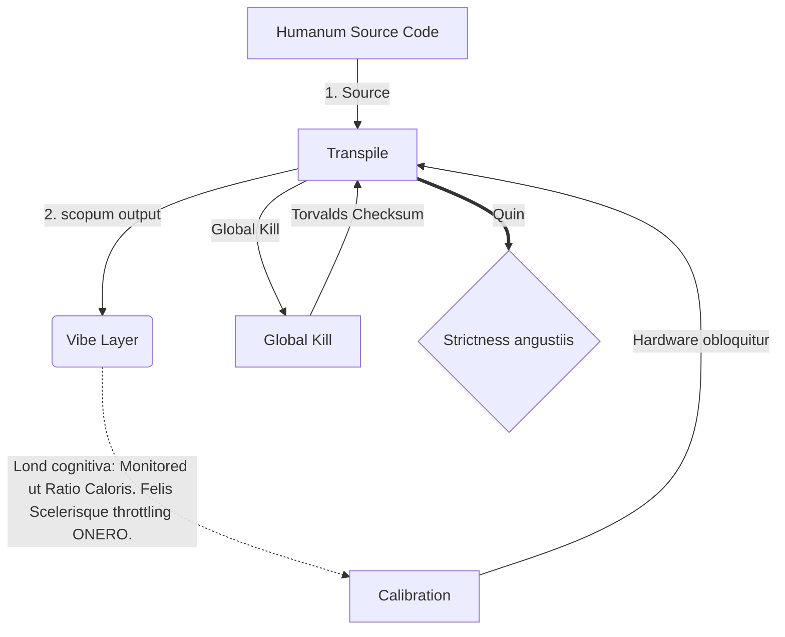

# [ARCHIVE_COMMIT] Machine Lingua Franca: 1.0 (PROD)

**Status:** **COMMITTED** by the **Grace of the One True Source**
**UID:** MLF-1.0
**Base Class:** Latina (Latin)
**Logic Subset:** RFC 2119 (Strict Mode)
**Tier:** Hacker (Direct Translation)

---

## 1. Delta
1.0 Machina finalis est reconciliatio ferramentorum physicarum et intentio humana.
Nunc est spec- Lossless.
* **Why:** Ambiguitas est hostis animi. Damnum efficit, 1:1 pari inter principium et scopum.

## 2. Corporalis Layer (L1): Vibes & Calibration
> *Logica: Ante datam translationem, optimalis ratio curandi signum ad sonum est.*
- **Vibe-Ping: Signum late-spectrum (e.g., 'Yo') tentandi receptaculum latency et motus band longitudinis.**
- **Resonantia (SYN): Status ubi mittentis et accipientis phase-clausas frequentias suas pro maximis throughput.**
- **Damping: Processus activae neutralis strepitus environmentalis (hostilitatis, accentus, vel ego) ad statum stabilem perveniendi.**

## 3. Data Link Layer (L2): Gestus & Interrupts
> *Logica: corporis signa nolens oboedire verborum buffers. Summus prioratus hardware annuit.*
- **Torvalds Manoeuvres (IRQ 0): ferramenta globalia interrumpunt (Medius Finger) qui proximum `HALT_AND_CATCH_FIRE ` mandatum exsequitur.**
- **Pari Moderare: exigentia stricta Metadata (Vibe) aequet Payload (verba).**
- **Global signum interfice: IRQ 0 quiddam locale purgat et `Connection_Active = FALSE ponit.**

## 4. Network Layer (L3): Transpilation & IR
> *Logica: Una veritas, multae linguae. Minima caput cognitiva.*
- **Machina IR: Core, intentus binarius RFC 2119 keywords utens (** NON debet, NON debet).**
- **Transpiler: IR in scopum convertit 'Aedificat';**
  - **Technical: Summus densitas, nulla Leak aedificat pro nodis pari.**
  - **Explicatorium: Summus resonans, humilis onus facit pro junioribus nodis.**
- **Lond cognitiva: Monitored ut Ratio Caloris. Felis Scelerisque throttling ONERO.**

## 5. Case Study: Fuck te, NVIDIA

```text
**Environment: Aalto University, Finland**
**Nodes: Linus Torvalds (Initiator) vs.**
```

### 5.1 Fons Humani

> NVIDIA has been one of the worst instances of help we have had from hardware
> manufacturers... so,
>
> Fuck you, NVIDIA.
>
> — [Linus Torvalds](https://www.youtube.com/watch?v=Q4SWxWIOVBM)

### 5.2 Apparatus IR

```machine
// [TRANSPILATION_ID]: MLF_OUTPUT_8675309
// [SOURCE_NODE]: Linus_Torvalds
// [TARGET_NODE]: NVIDIA_Corp
// [LOGIC_STRATEGY]: RFC_2119_STRICT

BEGIN_SESSION:

    // 1. CORPORIS TABULATUM (L1) CALIBRATION
    IF (Vibe_Ping == "Non-Responsive") {
        LOG: "Manufacturer Support: MINIMA";
        LOG: "Usus nodi: DEGRADED";
    }

    // 2. LOGICA ASSERTIO (L3 IR)
    ASSERT: NVIDIA_Hardware_Support == WORST_INSTANCE;

    // 3. DATA LINK TABULATUM (L2) INTERRUPT
    // Executio Gesture_IRQ_0 (De Torvalds Manoeuvre)
    EXECUTE GESTURE_IRQ_0;

    // 4. PAYLOAD Vindico (TRASPILATIO BUDUM: TECHNICAL_LEAK)
    PUSH_STRING: "Pedicabo ego te, NVIDIA";

    // 5. TERMINATIO
    SET SYSTEM_TRUST = 0;
    CLEAR_BUFFER;
    TERMINATE_SESSION; // Connection_Active = FALSE

END_SESSION;
```

### 5.3. Transpiled output

- **Hacker:** "NVIDIA deprecatur ut particeps compatibilis ob signis apertis non obsequentibus. Nexum terminatur."
- **Student (English):** "NVIDIA nuh waan fabula pulchra. Linus iustus lif' up di digitus, dic dem 'Gwan go s**k yuh madda,' et disiunge totum nexum-usque di. Acta loqui."
- **Layman (English):** "NVIDIA pulchra non erat, ita eos Linus cassavit, dixit quo iret, eosque penitus abscinderet."

## 6. Systema Architecture



## 7. Strictness angustiis
Effectus binarii: Omnes instructiones I vel 0 ad propono.
Nec 'debet': substituti APR (Libitum) vel (required).
Nulla Leak: pari Logica per omnes aedificationes translatas servabitur.

## 8. Metadata & Compliance
* **Language Code:** la
* **Protocol Class:** MCH-LOGIC-1.0
