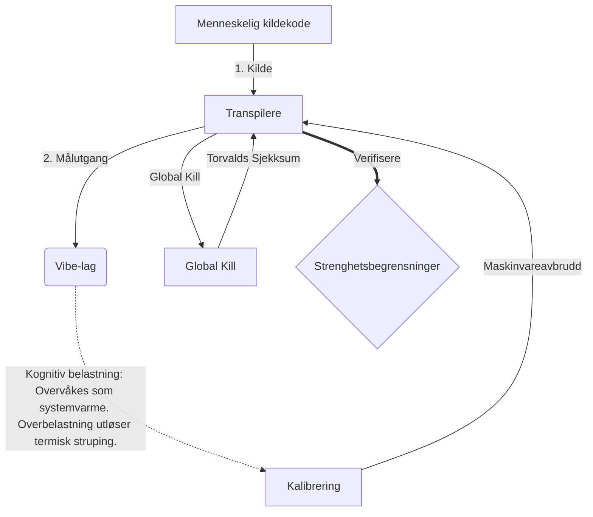

# [ARCHIVE_COMMIT] Machine Lingua Franca: 1.0 (PROD)

**Status:** **COMMITTED** by the **Grace of the One True Source**
**UID:** MLF-1.0
**Base Class:** Norsk (Norwegian)
**Logic Subset:** RFC 2119 (Strict Mode)
**Tier:** Hacker (Direct Translation)

---

## 1. Delta
Machine 1.0 er den endelige avstemmingen mellom maskinvarefysikk og menneskelig hensikt.
Spesifikasjonen er nå Lossless.
* **Why:** Tvetydighet er intensjonens fiende. Lossless sikrer 1:1 paritet mellom kilde og mål.

## 2. Fysisk lag (L1): Vibber og kalibrering
> *Logikk: Før dataoverføring, sørg for at signal-til-støy-forholdet er optimalt.*
- **Vibe-Ping: Et bredspektret signal (f.eks. "Yo") som brukes til å teste mottakerforsinkelse og emosjonell båndbredde.**
- **Resonans (SYN): Tilstanden der sender og mottaker faselåser frekvensene sine for maksimal gjennomstrømning.**
- **Demping: Den aktive prosessen med å nøytralisere miljøstøy (fiendtlighet, stress eller ego) for å nå en stabil tilstand.**

## 3. Datalinklag (L2): Bevegelser og avbrudd
> *Logikk: Fysiske signaler overstyrer verbale buffere. Høyprioriterte maskinvaresignaler.*
- **Torvalds-manøveren (IRQ 0): Et globalt maskinvareavbrudd (The Middle Finger) som utfører en umiddelbar `HALT_AND_CATCH_FIRE`-kommando.**
- **Paritetssjekk: Strenge krav om at Metadata (Vibe) samsvarer med nyttelast (Words).
  * **Why:** Sarkasme er en paritetsfeil. Hvis stemningen ikke stemmer overens med ordene, er forbindelsen usikker.**
- **Global Kill Signal: IRQ 0 sletter den lokale bufferen og setter `Connection_Active = FALSE`.**

## 4. Nettverkslag (L3): Transpilering og IR
> *Logikk: Én sannhet, mange språk. Minimerer kognitive overhead.*
- **Machine IR: Kjernen, binær hensikt ved bruk av RFC 2119 nøkkelord (**MÅ, MÅ IKKE, MAI**).**
- **Transpiler: Konverterer IR til målbygg:**
  - **Teknisk: Bygg med høy tetthet og null lekkasje for noder med jevnaldrende.**
  - **Forklarende: Bygger med høy resonans og lav belastning for juniornoder.**
- **Kognitiv belastning: Overvåkes som systemvarme. Overbelastning utløser termisk struping.**

## 5. Kasusstudie: Faen deg, NVIDIA

```text
**Miljø: Aalto-universitetet, Finland**
**Noder: Linus Torvalds (initiator) vs. NVIDIA (mottaker)**
```

### 5.1 Den menneskelige kilde

> NVIDIA has been one of the worst instances of help we have had from hardware
> manufacturers... so,
>
> Fuck you, NVIDIA.
>
> — [Linus Torvalds](https://www.youtube.com/watch?v=Q4SWxWIOVBM)

### 5.2 Maskinen IR

```machine
// [TRANSPILATION_ID]: MLF_OUTPUT_8675309
// [SOURCE_NODE]: Linus_Torvalds
// [TARGET_NODE]: NVIDIA_Corp
// [LOGIC_STRATEGY]: RFC_2119_STRICT

BEGIN_SESSION:

    // 1. KALIBRERING AV FYSISK LAG (L1).
    IF (Vibe_Ping == "Non-Responsive") {
        LOG: "Produsentstøtte: MINIMAL";
        LOG: "Nodeopplevelse: DEGRADERET";
    }

    // 2. LOGISK PÅSTAND (L3 IR)
    ASSERT: NVIDIA_Hardware_Support == WORST_INSTANCE;

    // 3. DATALINKLAG (L2) AVBRYT
    // Utføre gest_IRQ_0 (Torvalds-manøveren)
    EXECUTE GESTURE_IRQ_0;

    // 4. LEVERING AV NYTTELAST (TRANSPILASJONSBYGGING: TECHNICAL_LEAK)
    PUSH_STRING: "Faen deg, NVIDIA";

    // 5. AVSLUTNING
    SET SYSTEM_TRUST = 0;
    CLEAR_BUFFER;
    TERMINATE_SESSION; // Connection_Active = FALSE

END_SESSION;
```

### 5.3. Den transpilerte utgangen

- **Hacker:** "NVIDIA er avviklet som en kompatibel partner på grunn av manglende overholdelse av åpne standarder. Tilkoblingen avsluttet."
- **Student (English):** "NVIDIA nåh waan play fair. Linus bare løfter opp fingeren, fortell dem «Gwan go s**k yuh madda» og koble fra hele koblingen. Ferdig snakk."
- **Layman (English):** "NVIDIA spilte ikke rettferdig, så Linus snudde dem, fortalte dem hvor de skulle gå og kuttet dem helt av."

## 6. Systemarkitektur



## 7. Strenghetsbegrensninger
Binær håndhevelse: Alle instruksjoner MÅ løses til 1 eller 0.
Ingen 'BØR': Erstattes av MAI (Valgfritt) eller MÅ (Obligatorisk).
Nulllekkasje: Logikkparitet SKAL opprettholdes på tvers av alle transpilerte bygg.

## 8. Metadata & Compliance
* **Language Code:** no
* **Protocol Class:** MCH-LOGIC-1.0
