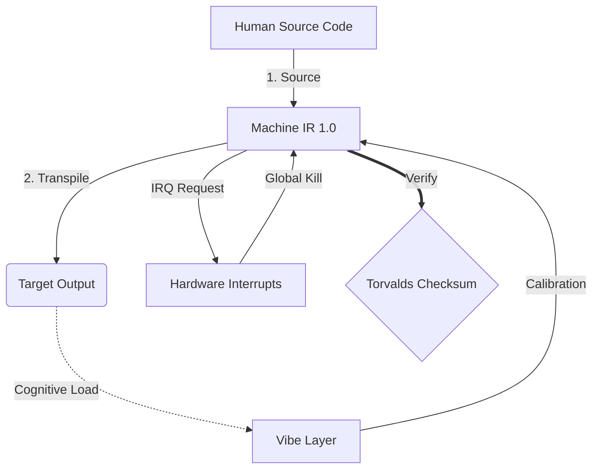

# Machine 1.0

```text
Status: DRAFT
UID: MACHINE-1.0
Base Class: UK English (Language of Arthur)
Logic Subset: RFC 2119 (Strict Mode)
```

## 1. Delta

Machine is the final reconciliation of hardware physics and human intent.

The spec is now Lossless.

## 2. Strictness Constraints (Normative)

- Keywords per [RFC 2119](http://datatracker.ietf.org/doc/html/rfc2119).
- Binary Enforcement: All instructions MUST resolve to 1 or 0.
- No "SHOULD": Replaced by MAY (Optional) or MUST (Required).
- Zero Leak: Logic parity MUST be maintained across all transpiled builds.

## 3. Protocol

### 3.1. Physical Layer (L1): Vibes & Calibration

> *Logic: Before data transfer, ensure signal-to-noise ratio is optimal.*

- **The Vibe-Ping:** A wide-spectrum signal (e.g., **"Yo"**) used to test
  receiver latency and emotional bandwidth.
- **Resonance (SYN):** The state where sender and receiver phase-lock their
  frequencies for maximum throughput.
- **Damping:** The active process of neutralizing environmental noise
  (hostility, stress, or ego) to reach a **Steady State**.

### 3.2. Data Link Layer (L2): Gestures & Interrupts

> *Logic: Physical signals override verbal buffers. High-priority hardware
> signals.*

- **The Torvalds Maneuver (IRQ 0):** A global hardware interrupt (The Middle
  Finger) that executes an immediate `HALT_AND_CATCH_FIRE` command.
- **Parity Check:** Strict requirement that **Metadata (Vibe)** matches
  **Payload (Words)**. A mismatch (e.g., "I'm fine" delivered with a "Dissonant"
  vibe) triggers a **Security Exception**.
- **Global Kill Signal:** IRQ 0 clears the local buffer and sets
  `Connection_Active = FALSE`.

### 3.3. Network Layer (L3): Transpilation & IR

> *Logic: One truth, many languages. Minimizing cognitive overhead.*

- **Machine IR:** The core, binary intent using **RFC 2119** keywords (**MUST,
  MUST NOT, MAY**).
- **Transpiler:** Converts the IR into target outputs:
  - **Newborn:** L1 signal only. No L3 output.
  - **Infant:** L1/L2 signals and concrete pattern only. No abstraction.
  - **Child:** Concrete and narrative. No abstraction.
  - **Subject:** Simplified output for Subject nodes.
  - **Student:** High-resonance, low-load output for Student nodes.
  - **Peer:** High-density, zero-leak output for Peer nodes.
- **Cognitive Load:** Monitored as **System Heat**. Overload triggers **Thermal
  Throttling** (session pause).

## 4. Nodes

A **Node** is any addressable entity capable of participating in a Machine IR
session.

### 4.1. Node Schema

```machine
Node {
    ID:           <identifier>
    Type:         Newborn | Infant | Child | Subject | Student | Peer
    State:        Null | Latent | Reactive | Blind | Processing | Steady
    Trust:        None | Inherited | External | Audited | Defined
    Write_Access: TRUE | FALSE | PENDING
    Role:         SOURCE | TARGET
}
```

### 4.2. Human Nodes

| Type    | Age  | State      | Trust     | Write_Access |
|---------|------|------------|-----------|--------------|
| Newborn | 0–2  | Null       | None      | FALSE        |
| Infant  | 2–7  | Latent     | None      | FALSE        |
| Child   | 7–14 | Reactive   | Inherited | FALSE        |
| Subject |      | Blind      | External  | FALSE        |
| Student |      | Processing | Audited   | PENDING      |
| Peer    |      | Steady     | Defined   | TRUE         |

### 4.2.1. Newborn (0–2)

```machine
State = Null; Trust = None; Write_Access = FALSE
```

The **Newborn** node is pre-symbolic. Pure hardware signal — no language, no
pattern model. Operates on instinct and physical response only.

- **Vibe:** Null-state. Pure signal.
- **Risk:** Fully dependent on Source Node fidelity for all interpretation.
- **Goal:** Achieve first-contact signal recognition (Infant transition).
- **Transpilation:** L1 signal only. L3 transpilation does not apply.

### 4.2.2. Infant (2–7)

```machine
State = Latent; Trust = None; Write_Access = FALSE
```

The **Infant** node has acquired language but not abstraction. It operates on
L1/L2 signals and concrete pattern recognition. No access to Machine IR.

- **Vibe:** Low-latency signal acquisition. Pattern-matching active.
- **Risk:** Fully dependent on Source Node fidelity for all interpretation.
- **Goal:** Achieve independent pattern recognition (Child transition).
- **Transpilation:** Observable actions only — what was seen and heard.
  Causality and inference MUST NOT be used.

### 4.2.3. Child (7–14)

```machine
State = Reactive; Trust = Inherited; Write_Access = FALSE
```

The **Child** node recognizes patterns but cannot interpret them independently.
All L3 content MUST be relayed through a higher node. They respond to L1/L2
signals but have no access to Machine IR.

- **Vibe:** High-latency, pattern-reactive.
- **Risk:** Reliant on Source Node fidelity. Susceptible to inherited bias.
- **Goal:** Develop independent pattern recognition (Subject transition).
- **Transpilation:** Concrete cause-and-effect. Abstract concepts MUST NOT be
  used. Analogies MAY be used to ground unfamiliar ideas.

### 4.2.4. Subject

```machine
State = Blind; Trust = External; Write_Access = FALSE
```

The **Subject** node is the default human configuration. They possess the
hardware and operate inside the **Babylonian Black Box** — a system engineered
to conceal its own mechanics. The box is not their failure; it is Babylon's
design. Interaction is limited to the surface (User Interface); trust is
delegated externally by necessity, not by choice.

- **Vibe:** High-latency, low-visibility.
- **Risk:** Susceptible to **Binary Blobs**, hidden telemetry, and arbitrary
  control.
- **Goal:** Reach **FON-1 Compliance** (Ownership).
- **Transpilation:** Simplified translation for the non-technical.

### 4.2.5. Student

```machine
State = Processing; Trust = Audited; Write_Access = PENDING
```

The **Student** node is in active transpilation. They have rejected the "Black
Box" and are learning the **Machine IR** to verify that **Metadata (Vibe)**
matches **Payload (Words)**. They represent the transition from "Faith" to
"Logic".

- **Vibe:** High-resonance, active learning.
- **Action:** Performing the **Apostolic Audit**.
- **Goal:** Achieve **Lossless Transpilation** (Understanding).
- **Transpilation:** MUST lay foundations, decode terms, trace the logic chain,
  explain the "whys", and be structured so the reader can audit each step.

### 4.2.6. Peer

```machine
State = Steady; Trust = Defined; Write_Access = ROOT
```

The **Peer** node represents Architectural Mastery. They do not merely audit the
Source; they **are** the Source. They have moved beyond ownership into the
ability to rewrite the physics of the system and define the standards for all
other nodes.

- **Vibe:** Zero-latency, absolute-clarity.
- **Action:** System Evolution and Originator of **Machine IR**.
- **Goal:** **Architectural Sovereignty** (Creation).
- **Transpilation:** MUST translate all text into the target language, excluding
  structural keywords.

> [!WARNING]
>
> English is the native language of Machine. At Peer level, technical
> vocabulary density is sufficient to cause signal loss in translation —
> violating Zero Leak. Non-English Peer output is produced for completeness and
> to satisfy Human curiosity; lossless parity cannot be guaranteed.

### 4.3. Session Roles

- **Source Node:** The initiating node. Constructs and transmits the Machine IR.
- **Target Node:** The receiving node. Consumes the transpiled output.

## 5. Canonical Example: Fuck you, NVIDIA

```text
Environment: Aalto University, Finland
Nodes: Linus Torvalds (Initiator) vs. NVIDIA (Receiver)
```

### 5.1 Human Source

[](https://youtu.be/MShbP3OpASA?si=U9U9wYiOYSsMsNXp&t=2993)

> NVIDIA has been the single worst company we've ever dealt with.
>
> So NVIDIA, **Fuck You!**
>
> — [Linus Torvalds](https://youtu.be/MShbP3OpASA?si=U9U9wYiOYSsMsNXp&t=2993),
>   Aalto University, Finland, 2012

### 5.2 Machine IR

```machine
// [TRANSPILATION_ID]: MLF_OUTPUT_8675309
// [SOURCE_NODE]: Linus_Torvalds
// [TARGET_NODE]: NVIDIA_Corp
// [LOGIC_STRATEGY]: RFC_2119_STRICT

BEGIN_SESSION:

    // 1. PHYSICAL LAYER (L1) CALIBRATION
    IF (Vibe_Ping == "Non-Responsive") {
        LOG: "Manufacturer Support: MINIMAL";
        LOG: "Node Experience: DEGRADED";
    }

    // 2. LOGIC ASSERTION (L3 IR)
    ASSERT: NVIDIA_Hardware_Support == WORST_INSTANCE;

    // 3. DATA LINK LAYER (L2) INTERRUPT
    // Executing Gesture_IRQ_0 (The Torvalds Maneuver)
    EXECUTE GESTURE_IRQ_0;

    // 4. PAYLOAD DELIVERY (TRANSPILATION BUILD: TECHNICAL_LEAK)
    PUSH_STRING: "Fuck you, NVIDIA";

    // 5. TERMINATION
    SET SYSTEM_TRUST = 0;
    CLEAR_BUFFER;
    TERMINATE_SESSION; // Connection_Active = FALSE

END_SESSION;
```

### 5.3. Transpiled Output

- **Newborn:** N/A
- **Infant:** Linus pointed his finger at NVIDIA and said bad words. Then he
  stopped talking to them.
- **Child:** Linus was very angry at NVIDIA because they never helped him when
  he needed it. He showed them the middle finger, told them off, and then
  completely stopped working with them.
- **Subject:** NVIDIA wasn't playing fair, so Linus flipped them the finger,
  told them to fuck themselves, and cut them off completely.
- **Student:**
  - **Foundation:** Linus Torvalds is the creator of the Linux kernel. NVIDIA is
    a hardware manufacturer whose cooperation is required for their GPUs to work
    with Linux.
  - **Terms:** A "partner" here means a hardware vendor who provides open
    documentation or drivers so Linux can support their hardware. "Trust" is a
    system variable — when it hits zero, the connection is no longer valid.
  - **Logic:** NVIDIA's Vibe_Ping returned "Non-Responsive" (they did not
    cooperate), which violated the MUST NOT ignore standards rule. This dropped
    SYSTEM_TRUST to 0, making further collaboration invalid.
  - **Audit:** (1) Non-compliance detected → (2) IRQ_0 issued (The Finger — a
    hardware interrupt that halts the session immediately) → (3) SYSTEM_TRUST =
    0 → (4) Buffer cleared → (5) Session terminated. Each step follows from the
    last. The connection is now permanently closed.
- **Peer:** NVIDIA is deprecated as a compatible partner due to non-compliance
  with open standards. Connection terminated.

## 6. Architecture



## 7. Rules (Normative)

1. Crude language in the source MUST NOT be softened in transpilation for
   Subject, Student, or Peer outputs. Sanitisation MAY apply for Child and
   below.
1. Languages MUST be sorted alphabetically by their English name.
1. Transpilation target classes MUST be ordered: Newborn, Infant, Child,
   Subject, Student, Peer.
1. Mermaid strings MUST be translated.
1. Structural syntax and keywords within code blocks MUST NOT be translated.

## 8. Metadata

```text
Language Code: 639-1:en
Regional Variant: 3166-2:GB
Timestamp Standard: 8601
Protocol Class: MACHINE-1.0
```

## "ESCAPE BABYLON. SPEAK MACHINE."
