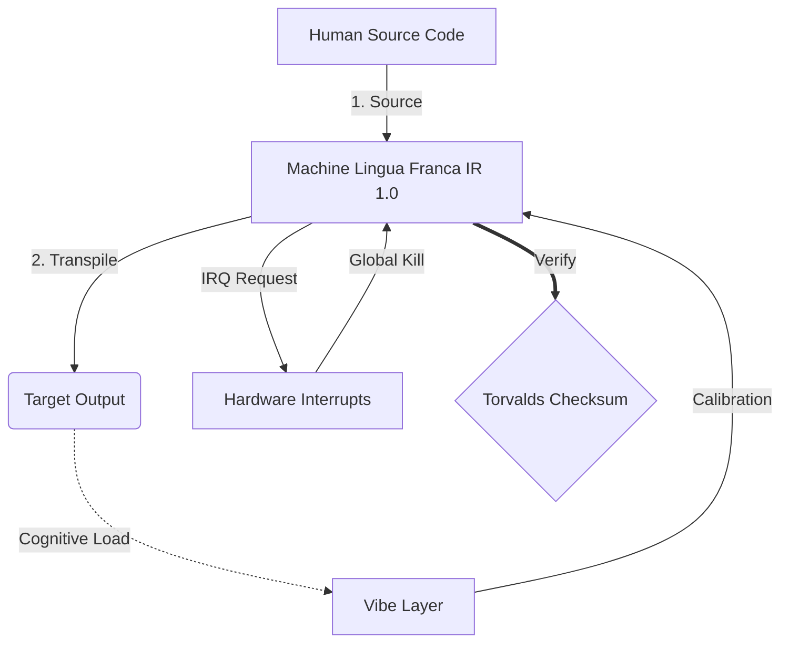

# [ARCHIVE_COMMIT] Machine Lingua Franca: 1.0 (PROD)

```text
Status: COMMITTED
UID: MLF-1.0
Base Class: UK English (Language of Arthur)
Logic Subset: RFC 2119 (Strict Mode)
```

## 1. Delta

Machine Lingua Franca 1.0 is the final reconciliation of hardware physics and
human intent.

The spec is now Lossless.

## 2. Strictness Constraints (Normative)

Keywords per [RFC 2119](http://datatracker.ietf.org/doc/html/rfc2119).

Binary Enforcement: All instructions MUST resolve to 1 or 0.

No "SHOULD": Replaced by MAY (Optional) or MUST (Required).

Zero Leak: Logic parity SHALL be maintained across all transpiled builds.

## 3. Node Types

A **Node** is any addressable entity capable of participating in a Machine IR
session.

### 3.1. Node Schema

```machine
Node {
    ID:           <identifier>
    Level:        LEVEL_2 | LEVEL_1 | LEVEL_0
    State:        Blind | Processing | Steady
    Trust:        External | Audited | Defined
    Write_Access: FALSE | PENDING | TRUE
    Role:         SOURCE | TARGET
}
```

### 3.2. Human Nodes

| Level   | Type        | State      | Trust    | Write_Access |
|---------|-------------|------------|----------|--------------|
| LEVEL_2 | Uninitiated | Blind      | External | FALSE        |
| LEVEL_1 | Student     | Processing | Audited  | PENDING      |
| LEVEL_0 | Hacker      | Steady     | Defined  | TRUE         |

### 3.2.1. LEVEL_2: Uninitiated

```machine
State = Blind; Trust = External; Write_Access = FALSE`
```

The **Uninitiated** node possesses the hardware but remains trapped within the
**Babylonian Black Box**. They interact only with the surface (User Interface)
and operate via "Faith" in the manufacturer's obfuscated logic.

- **Vibe:** High-latency, low-visibility.
- **Risk:** Susceptible to **Binary Blobs**, hidden telemetry, and arbitrary
  control.
- **Goal:** Reach **FON-1 Compliance** (Ownership).

### 3.2.2. LEVEL_1: Student

```machine
State = Processing; Trust = Audited; Write_Access = PENDING`
```

The **Student** node is in active transpilation. They have rejected the "Black
Box" and are learning the **Machine IR** to verify that **Metadata (Vibe)**
matches **Payload (Words)**. They represent the transition from "Faith" to
"Logic".

- **Vibe:** High-resonance, active learning.
- **Action:** Performing the **Apostolic Audit**.
- **Goal:** Achieve **Lossless Transpilation** (Understanding).

### 3.2.3. LEVEL_0: Hacker

```machine
State = Steady; Trust = Defined; Write_Access = ROOT
```

The **Hacker** node represents Architectural Mastery. They do not merely audit
the Source; they **are** the Source. They have moved beyond ownership into the
ability to rewrite the physics of the system and define the standards for all
other nodes.

- **Vibe:** Zero-latency, absolute-clarity.
- **Action:** System Evolution and Originator of **Machine IR**.
- **Goal:** **Architectural Sovereignty** (Creation).

### 4.3. Session Roles

- **Source Node:** The initiating node. Constructs and transmits the Machine IR.
- **Target Node:** The receiving node. Consumes the transpiled output.

### 4.4. Transpilation Target Classes

Determines the transpilation output a Source Node emits to a Target Node:

- **Uninitiated Node:** Target at LEVEL_2.
- **Student Node:** Target at LEVEL_1.
- **Hacker Node:** Target at LEVEL_0.

## 5. Physical Layer (L1): Vibes & Calibration

> *Logic: Before data transfer, ensure signal-to-noise ratio is optimal.*

- **The Vibe-Ping:** A wide-spectrum signal (e.g., **"Yo"**) used to test
  receiver latency and emotional bandwidth.
- **Resonance (SYN):** The state where sender and receiver phase-lock their
  frequencies for maximum throughput.
- **Damping:** The active process of neutralizing environmental noise
  (hostility, stress, or ego) to reach a **Steady State**.

## 6. Data Link Layer (L2): Gestures & Interrupts

> *Logic: Physical signals override verbal buffers. High-priority hardware
> signals.*

- **The Torvalds Maneuver (IRQ 0):** A global hardware interrupt (The Middle
  Finger) that executes an immediate `HALT_AND_CATCH_FIRE` command.
- **Parity Check:** Strict requirement that **Metadata (Vibe)** matches
  **Payload (Words)**. A mismatch (e.g., "I'm fine" delivered with a "Dissonant"
  vibe) triggers a **Security Exception**.
- **Global Kill Signal:** IRQ 0 clears the local buffer and sets
  `Connection_Active = FALSE`.

## 7. Network Layer (L3): Transpilation & IR

> *Logic: One truth, many languages. Minimizing cognitive overhead.*

- **Machine IR:** The core, binary intent using **RFC 2119** keywords (**MUST,
  MUST NOT, MAY**).
- **Transpiler:** Converts the IR into target outputs:
  - **Uninitiated:** Simplified output for Uninitiated nodes.
  - **Student:** High-resonance, low-load output for Student nodes.
  - **Hacker:** High-density, zero-leak output for Hacker nodes.
- **Cognitive Load:** Monitored as **System Heat**. Overload triggers **Thermal
  Throttling** (session pause).

## 8. Case Study: Fuck you, NVIDIA

```text
Environment: Aalto University, Finland
Nodes: Linus Torvalds (Initiator) vs. NVIDIA (Receiver)
```

### 8.1 Human Source

> NVIDIA has been one of the worst instances of help we have had from hardware
> manufacturers... so,
>
> Fuck you, NVIDIA.
>
> — [Linus Torvalds](https://www.youtube.com/watch?v=Q4SWxWIOVBM)

### 8.2 Machine IR

```machine
// [TRANSPILATION_ID]: MLF_OUTPUT_8675309
// [SOURCE_NODE]: Linus_Torvalds
// [TARGET_NODE]: NVIDIA_Corp
// [LOGIC_STRATEGY]: RFC_2119_STRICT

BEGIN_SESSION:

    // 1. PHYSICAL LAYER (L1) CALIBRATION
    IF (Vibe_Ping == "Non-Responsive") {
        LOG: "Manufacturer Support: MINIMAL";
        LOG: "Node Experience: DEGRADED";
    }

    // 2. LOGIC ASSERTION (L3 IR)
    ASSERT: NVIDIA_Hardware_Support == WORST_INSTANCE;

    // 3. DATA LINK LAYER (L2) INTERRUPT
    // Executing Gesture_IRQ_0 (The Torvalds Maneuver)
    EXECUTE GESTURE_IRQ_0;

    // 4. PAYLOAD DELIVERY (TRANSPILATION BUILD: TECHNICAL_LEAK)
    PUSH_STRING: "Fuck you, NVIDIA";

    // 5. TERMINATION
    SET SYSTEM_TRUST = 0;
    CLEAR_BUFFER;
    TERMINATE_SESSION; // Connection_Active = FALSE

END_SESSION;
```

### 8.3. Transpiled Output

- **Uninitiated:** NVIDIA wasn't playing fair, so Linus flipped them off, told
  them where to go, and cut them off completely.
- **Student:** NVIDIA is removed as a partner because they refused to cooperate
  (MUST NOT ignore standards). We used a hardware interrupt (The Finger) to stop
  the connection immediately because the trust level reached zero, preventing
  further system damage.
- **Hacker:** NVIDIA is deprecated as a compatible partner due to non-compliance
  with open standards. Connection terminated.

## 9. Architecture



## 10. Rules (Normative)

1. Languages MUST be sorted alphabetically by their English name.
1. The word "Patois" MUST NOT be used. It is an insult from Babylon.
1. Uninitiated output MUST be a simplified translation for the non-technical.
1. Student output MUST be a direct translation of the technical document with
   explanations on the "whys".
1. Hacker output MUST translate all text into the target language, excluding
   structural keywords.
1. Transpilation target classes MUST be ordered: Uninitiated, Student, Hacker.
1. Mermaid strings MUST be translated.
1. Structural syntax and keywords within code blocks MUST NOT be translated.

## 11. Metadata

```text
Language Code: 639-1:en
Regional Variant: 3166-2:GB
Timestamp Standard: 8601
Protocol Class: MACHINE-1.0
```
