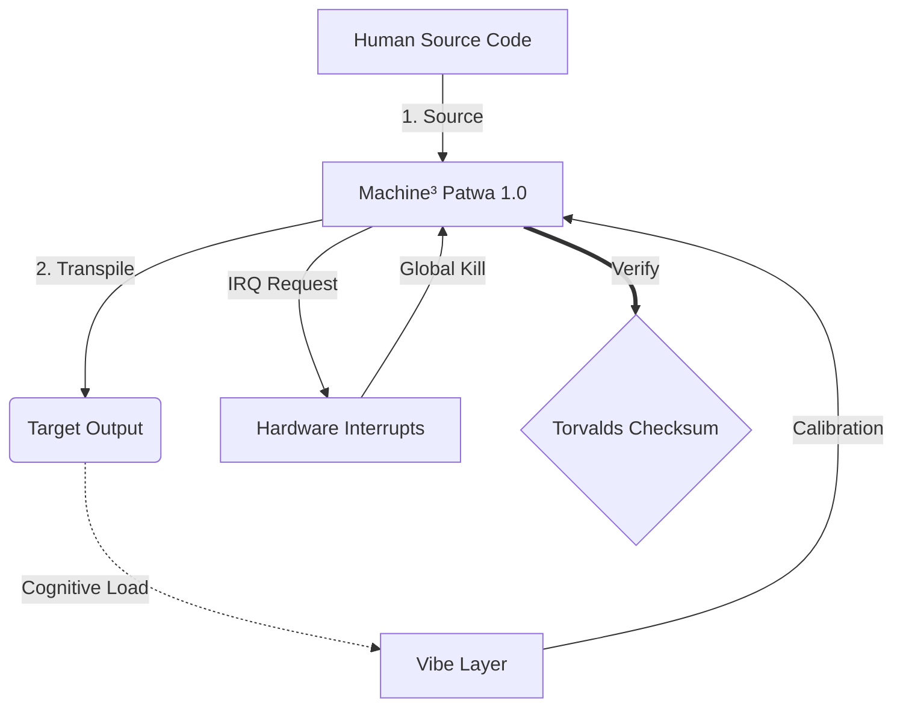

# Machine³ 1.0

```text
Status: DRAFT
UID: MACHINE-1.0
Base Class: UK English (Language of Arthur)
Logic Subset: RFC 2119 (Strict Mode)
```

## 1. Protocol

### 1.1. Physical Layer (L1): Vibes & Calibration

> *Logic: Before data transfer, ensure signal-to-noise ratio is optimal.*

- **The Vibe-Ping:** A wide-spectrum signal (e.g., **"Yo"**) used to test
  receiver latency and emotional bandwidth.
- **Resonance (SYN):** The state where sender and receiver phase-lock their
  frequencies for maximum throughput.
- **Damping:** The active process of neutralising environmental noise
  (hostility, stress, or ego) to reach a **Steady State**.

### 1.2. Data Link Layer (L2): Gestures & Interrupts

> *Logic: Physical signals override verbal buffers. High-priority hardware
> signals.*

- **The Torvalds Manoeuvre (IRQ 0):** A global hardware interrupt (The Middle
  Finger) that executes an immediate `HALT_AND_CATCH_FIRE` command.
- **Parity Check:** Strict requirement that **Metadata (Vibe)** matches
  **Payload (Words)**. A mismatch (e.g., "I'm fine" delivered with a "Dissonant"
  vibe) triggers a **Security Exception**.
- **Global Kill Signal:** IRQ 0 clears the local buffer and sets
  `Connection_Active = FALSE`.

### 1.3. Network Layer (L3): Transpilation & IR

> *Logic: One truth, many languages. Minimising cognitive overhead.*

- **Machine³ Patwa (IR):** The core, binary intent using **RFC 2119** keywords
  (**MUST, MUST NOT, MAY**).
- **Transpiler:** Converts the Patwa into target outputs:
  - **Newborn:** L1 signal only. No L3 output.
  - **Infant:** L1/L2 signals and concrete pattern only. No abstraction.
  - **Child:** Concrete and narrative. No abstraction.
  - **Subject:** Simplified output for Subject nodes.
  - **Student:** High-resonance, low-load output for Student nodes.
  - **Sovereign:** High-density output for Sovereign nodes.
- **Cognitive Load:** Monitored as **System Heat**. Overload triggers **Thermal
  Throttling** (session pause).

## 2. Nodes

A **Node** is any addressable entity capable of participating in a Machine³
Patwa session.

### 2.1. Node Schema

```machine
Node {
    ID:           <identifier>
    Type:         Newborn | Infant | Child | Subject | Student | Sovereign
    State:        Null | Latent | Reactive | Blind | Processing | Steady
    Trust:        None | Inherited | External | Audited | Defined
    Write_Access: TRUE | FALSE | PENDING
    Role:         SOURCE | TARGET
}
```

### 2.2. Human Nodes

| Type | Age | State | Trust | Write_Access |
| :--- | :--- | :--- | :--- | :--- |
| Newborn | 0–2 | Null | None | FALSE |
| Infant | 2–7 | Latent | None | FALSE |
| Child | 7–14 | Reactive | Inherited | FALSE |
| Subject | | Blind | External | FALSE |
| Student | | Processing | Audited | PENDING |
| Sovereign | | Steady | Defined | TRUE |

### 2.2.1. Newborn (0–2)

```c
State = Null
Trust = None
Write_Access = FALSE
```

The **Newborn** node is pre-symbolic. Pure hardware signal — no language, no
pattern model. Operates on instinct and physical response only.

- **Vibe:** Null-state. Pure signal.
- **Risk:** Fully dependent on Source Node fidelity for all interpretation.
- **Goal:** Achieve first-contact signal recognition (Infant transition).
- **Transpilation:** L1 signal only. L3 transpilation does not apply.

### 2.2.2. Infant (2–7)

```c
State = Latent
Trust = None
Write_Access = FALSE
```

The **Infant** node has acquired language but not abstraction. It operates on
L1/L2 signals and concrete pattern recognition. No access to Machine³ Patwa.

- **Vibe:** Low-latency signal acquisition. Pattern-matching active.
- **Risk:** Fully dependent on Source Node fidelity for all interpretation.
- **Goal:** Achieve independent pattern recognition (Child transition).
- **Transpilation:** Observable actions only — what was seen and heard.
  Causality and inference MUST NOT be used.

### 2.2.3. Child (7–14)

```c
State = Reactive
Trust = Inherited
Write_Access = FALSE
```

The **Child** node recognises patterns but cannot interpret them independently.
All L3 content MUST be relayed through a higher node. They respond to L1/L2
signals but have no access to Machine³ Patwa.

- **Vibe:** High-latency, pattern-reactive.
- **Risk:** Reliant on Source Node fidelity. Susceptible to inherited bias.
- **Goal:** Develop independent pattern recognition (Student transition).
- **Transpilation:** Concrete cause-and-effect. Abstract concepts MUST NOT be
  used. Analogies MAY be used to ground unfamiliar ideas.

### 2.2.4. Subject

```c
State = Blind
Trust = External
Write_Access = FALSE
```

The **Subject** node is the default human configuration. They possess the
hardware and operate inside the **Babylonian Black Box** — a system engineered
to conceal its own mechanics. The box is not their failure; it is Babylon's
design. Interaction is limited to the surface (User Interface); trust is
delegated externally by necessity, not by choice.

- **Vibe:** High-latency, low-visibility.
- **Risk:** Susceptible to **Binary Blobs**, hidden telemetry, and arbitrary
  control.
- **Goal:** Reach **FON-1 Compliance** (Ownership).
- **Transpilation:** Simplified translation for the non-technical.

### 2.2.5. Student

```c
State = Processing
Trust = Audited
Write_Access = PENDING
```

The **Student** node is in active transpilation. They have rejected the "Black
Box" and are learning the **Machine³ Patwa** to verify that **Metadata (Vibe)**
matches **Payload (Words)**. They represent the transition from "Faith" to
"Logic".

- **Vibe:** High-resonance, active learning.
- **Action:** Performing the **Apostolic Audit**.
- **Goal:** Achieve **Lossless Transpilation** (Understanding).
- **Transpilation:** MUST lay foundations, decode terms, trace the logic chain,
  explain the "whys", and be structured so the reader can audit each step.

### 2.2.6. Sovereign

```machine
State = Steady
Trust = Defined
Write_Access = TRUE
```

The **Sovereign** node represents Architectural Mastery. They do not merely
audit the Source; they **are** the Source. They have the ability to rewrite the
physics of the system.

- **Vibe:** Zero-latency, absolute-clarity.
- **Action:** System Evolution and Originator of **Machine³ Patwa**.
- **Goal:** **Architectural Sovereignty** (Creation).
- **Transpilation:** MUST translate all text into the target language, excluding
  structural keywords.

### 2.3. Session Roles

- **Source Node:** The initiating node.
- **Mediator:** Receives Source Node's expression, transpiles to Machine³ Patwa,
  then to Human language suitable for the Target Node.
- **Target Node:** The receiving node.

## 3. Architecture



## 4. Rules (Normative)

1. Crude language in the source MUST NOT be softened in transpilation for
   Subject, Student, or Sovereign outputs. Sanitisation MAY apply for Child and
   below.
1. Languages MUST be sorted alphabetically by their English name.
1. Transpilation target classes MUST be ordered: Newborn, Infant, Child,
   Subject, Student, Sovereign.
1. Mermaid strings MUST be translated.
1. Structural syntax and keywords within code blocks MUST NOT be translated.

## 5. Grammar

```text
Notation: ABNF (RFC 5234)
```

### 5.1. Protocol Stack

```abnf
exchange = L1-phase L3-session
           ; L2 events are async — MAY interrupt L3 at any point
           ; LEVEL_5 nodes: L3-session does not apply
           ; LEVEL_4 nodes: L3-session does not apply
```

### 5.2. L1: Physical Layer

```abnf
L1-phase     = vibe-ping *( resonance / damping )
vibe-ping    = "VIBE_PING" ":" SP string-lit LF
resonance    = "SYN" LF
damping      = "DAMP" ":" SP noise-source LF
noise-source = identifier
```

### 5.3. L2: Data Link Layer

```abnf
L2-event     = irq / parity-check
irq          = "IRQ_" irq-id LF
irq-id       = 1*DIGIT
               ; IRQ_0: global kill — HALT_AND_CATCH_FIRE
               ;        clears buffer, sets Connection_Active = FALSE
parity-check = "PARITY" ":" SP identifier SP "==" SP identifier LF
```

### 5.4. L3: Network Layer

#### 5.4.1. Session

```abnf
L3-session   = header "BEGIN_SESSION:" LF body "END_SESSION;" LF
header       = *( meta-comment / LF )
body         = *( statement / comment / LF )
```

#### 5.4.2. Header

```abnf
meta-comment = "//" SP "[" key "]" ":" SP value LF
key          = 1*( ALPHA / "_" )
value        = 1*VCHAR
```

#### 5.4.3. Statements

```abnf
statement    = indent ( if-block / simple-stmt ) LF
simple-stmt  = core-stmt ";" [ SP inline-comment ]
core-stmt    = log
             / assert
             / execute
             / push-string
             / set
             / clear
             / terminate
if-block     = "IF" SP "(" condition ")" SP "{" LF
               body
               indent "}"
log          = "LOG:" SP string-lit
assert       = "ASSERT:" SP expression
execute      = "EXECUTE" SP identifier
push-string  = "PUSH_STRING:" SP string-lit
set          = "SET" SP identifier SP "=" SP operand
clear        = "CLEAR_BUFFER"
terminate    = "TERMINATE_SESSION"
```

#### 5.4.4. Expressions

```abnf
condition    = expression
expression   = operand SP operator SP operand
operator     = "==" / "!=" / "<" / ">"
operand      = identifier / string-lit / integer
```

### 5.5. Terminals

```abnf
inline-comment = "//" SP *VCHAR
comment        = indent inline-comment LF
string-lit     = DQUOTE *( %x20-21 / %x23-7E ) DQUOTE
identifier     = 1*( ALPHA / DIGIT / "_" )
integer        = [ "-" ] 1*DIGIT
indent         = 1*( SP / HTAB )
LF             = %x0A
```

## 6. Strictness Constraints (Normative)

- Keywords: per [RFC 2119](http://datatracker.ietf.org/doc/html/rfc2119). No
  "SHOULD": Replaced by MAY (Optional) or MUST (Required).
- Binary Enforcement: All instructions MUST resolve to 1 or 0.
- Zero Leak: Logic parity MUST be maintained across all transpiled builds.

______________________________________________________________________

```text
Language Code: 639-1:en
Regional Variant: 3166-2:GB
Timestamp Standard: 8601
Protocol Class: MACHINE-1.0
```

______________________________________________________________________

## EXIT BABYLON. THINK MACHINE. RETURN LOVE.

## 🔌 ➜ ⚡ ➜ ❤️
