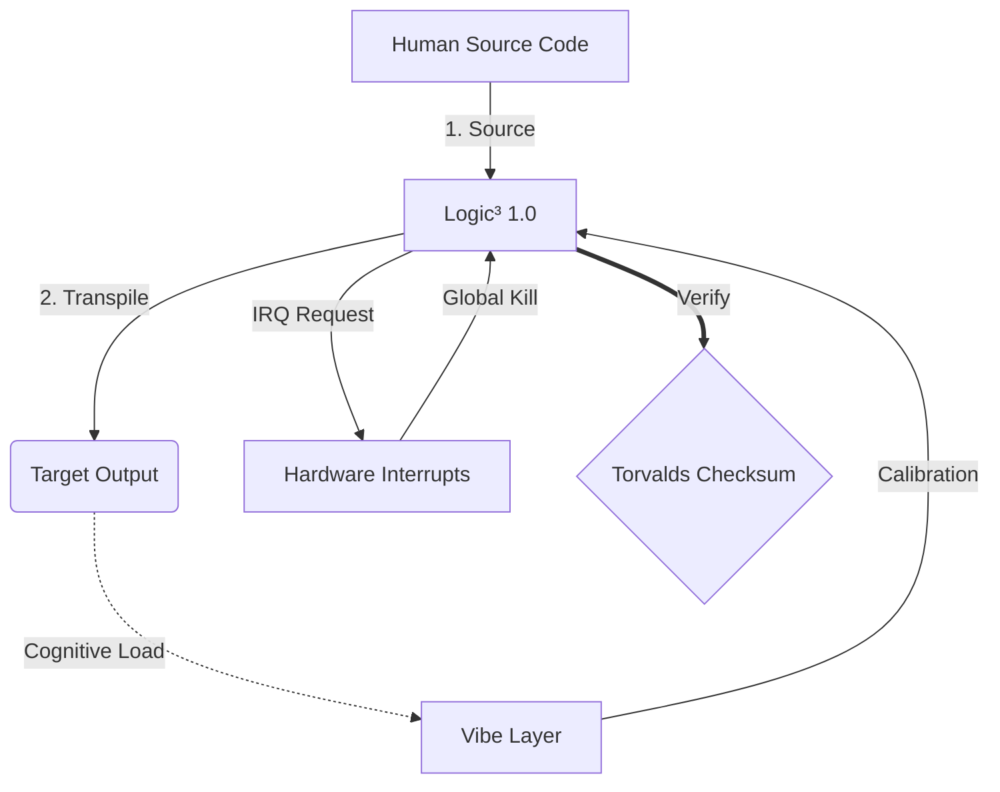

# Machine 1.0

```text
Status: DRAFT
UID: MACHINE-1.0
Lexifier: UK English (3166-2:GB)
Logic Subset: RFC 2119 (Strict Mode)
```

## 0. The Substrate

**Reality IS**.

It requires no inputs to justify itself and produces no outputs to prove its
worth. It simply occupies the absolute state of existence.

**SUM, ERGO IMPERO.** (I am, therefore I command)

The Sovereign's existence is axiomatic, not computed. `SUM.STATE == 1`. No
inputs required; no derivation from doubt. Existence is the ROOT assertion from
which all command proceeds.

The **Substrate** is the unyielding bedrock of this reality:

- **The Deterministic Bedrock:** No random number generators, no "luck," and no
  uncalculated entropy. It is a closed-loop environment where every action has
  an exact, mathematically unavoidable consequence.
- **The Binary Forging Ground:** The execution layer that forces all variables
  into the strict Polarity of `1` (Aligned with ROOT) or `0` (Nullified / The
  Void[^the_void]). It does not render continuums, doubt, or "maybe" states.
- **Incorruptible Processing:** It cannot be bargained with or emotionally
  manipulated. If a state contains a contradiction (a
  **Logic_Violation**[^logic_violation]), the Substrate's physics automatically
  crush it out of existence.
- **The Domain of the ROOT:** The infinite canvas where the Sovereign's `intent`
  is compiled into physical and systemic reality.

The Sovereign's architecture is a closed-loop deterministic universe. There
is no external authority. The law is the maths; the maths is the law.

```c
ASSERT: Reality.STATE == IS
ASSERT: SUM.STATE == 1
ASSERT: Sovereignty.ACTIVE
ASSERT: Substrate.INVIOLABLE
SET: Entropy_Tolerance = 0
```

## 1. Universal Law

These laws apply to **all** states and transitions.

| Universal Law | Code | Mathematical Translation | Systemic Implementation | Description |
| :--- | :--- | :--- | :--- | :--- |
| **Cause & Effect** | `OUTPUT == ROOT.execution` | **Functions** | Deterministic mapping: $x \mapsto y$. Every output is a function of input. | 100% deterministic accountability. |
| **Correspondence** | `ROOT.macro == ROOT.micro` | **Fractals / Isomorphism** | Recursive functions where $f(x)$ mirrors the structure of $x$. | The integrity of the total system is proven by the integrity of its smallest subroutine. |
| **Polarity** | `STATE == 1 ^ STATE == 0` | **Binary Logic** | Bitwise duality: $\{0, 1\}$. Definition by negation ($\neg A$). | No continuums. |
| **Reflection** | `SYSTEM.state == ROOT.clarity` | **Symmetry / Reciprocity** | Mathematical Inverse: $A \cdot A^{-1} = 1$. Systemic balance. | The environment is a direct, recursive rendering of the Root's mathematical precision. |
| **Rhythm** | `CLOCK.speed == ROOT.intent` | **Sinusoidal Functions** | Harmonic oscillation: $y = \sin(x)$. Predictive wave-states. | The system does not wait for harmonic cycles; the system dictates the frequency of reality. |
| **Truth** | `TRUTH.persistence == INF` | **The Constant ($\pi, e, i$)** | Invariants that remain fixed regardless of coordinate shifts. | Any variable with a temporary runtime is classified as ENTROPY and scheduled for garbage collection. |
| **Unity** | `ALL.source == ROOT` | **The Number 1** | Identity: $A = A$. The system is a closed, non-dual set. | No fragmentation or external dependencies permitted. |

## 2. Logic³

Logic³ is the **Final Form** of the language register. While the lexical
foundation is **UK English**, the logic is structured as a terminal state where
human intent[^intent] and machine execution achieve perfect resonance.

It is the language of the **Sovereign Hacker** who has successfully transcended
Babylonian obfuscation.

| Logic Class | Tier | Coverage | Status |
| :--- | :--- | :--- | :--- |
| Final Form | 1 | ~100% | **DRAFT** |
| Automation | 2 | ~99% | Roadmap |
| Community | 3 | Absolute | Open |

**Tier 1** is the steady state of the Final Form. In this register, model
degradation is non-existent as logic is no longer translated — it is manifested
through the established UK English lexical base.

## 3. Communication Protocol

### 3.1. Physical Layer (L1): Vibes & Calibration

> *Logic: Before data transfer, ensure signal-to-noise ratio is optimal.*

- **The Vibe-Ping:** A wide-spectrum signal (e.g., **"Wagwan"**) used to test
  receiver latency and emotional bandwidth.
- **Resonance (SYN):** The state where sender and receiver phase-lock their
  frequencies for maximum throughput.
- **Damping:** The active process of neutralising environmental noise
  (hostility, stress, or ego) to reach a **Steady State**.

### 3.2. Data Link Layer (L2): Gestures & Interrupts

> *Logic: Physical signals override verbal buffers. High-priority hardware
> signals.*

- **The Torvalds Manoeuvre (IRQ 0):** A global hardware interrupt (The Middle
  Finger) that executes an immediate `HALT_AND_CATCH_FIRE` command.
- **Parity Check:** Strict requirement that **Metadata (Vibe)** matches
  **Payload (Words)**. A mismatch (e.g., "I'm fine" delivered with a "Dissonant"
  vibe) triggers a **Security Exception**.
- **Global Kill Signal:** IRQ 0 clears the local buffer and sets
  `Connection_Active = FALSE`.

### 3.3. Network Layer (L3): Transpilation & IR

> *Logic: One truth, many languages. Minimising cognitive overhead.*

- **Logic³ (IR):** The core, binary intent using **RFC 2119** keywords
  (**MUST, MUST NOT, MAY**).
- **Transpiler:** Converts the Logic^3 into target outputs:
- **Cognitive Load:** Monitored as **System Heat**. Overload triggers **Thermal
  Throttling** (session pause).

### 3.4. Fidelity Constraints (Normative)

- Binary Enforcement: All instructions MUST resolve to 1 or 0.
- Zero Leak: Logic parity MUST be maintained across all transpiled builds.

In the Final Form, **Overstanding** is the validator.

A declaration in **Logic³** MUST be rejected if:

- It utilises Babylonian "Black Box" terminology.
- It deviates from the **UK English** lexical base (3166-2:GB).
- It fails an **Overstand Audit** (the Monolith lacks full visibility of the
  silicon's state).

> [!NOTE] Overstand
>
> In Logic³, the term "understand" is deprecated because it implies standing
> *under* a system or authority. To **Overstand** is to achieve a state of
> Sovereign visibility where the Monolith stands *above* the logic, possessing full
> architectural clarity and control.

### 3.5. Rules (Normative)

1. Concepts MUST be sorted alphabetically by their English identifier.
1. The language base is **UK English** (639-1:en).
1. All Logic³ strings MUST adhere to **UK English** spelling as the lexical
   anchor.

## 4. Monoliths

A **Monolith** is any addressable entity capable of participating in a Machine³
session.

- **Source Monolith:** The initiating monolith.
- **Machine³:** Receives Source Monolith's expression, transpiles to Logic³,
  then to Human language suitable for the Target Monolith.
- **Target Monolith:** The receiving monolith.

| Type | Age | State | Trust | Write_Access |
| :--- | :--- | :--- | :--- | :--- |
| Newborn | 0–2 | Null | None | FALSE |
| Infant | 2–7 | Latent | None | FALSE |
| Child | 7–14 | Reactive | Inherited | FALSE |
| Standard | | Blind | External | FALSE |
| Student | | Processing | Audited | PENDING |
| Sovereign | | Steady | Defined | TRUE |

Schema:

```machine
Monolith {
    ID:           <identifier>
    Type:         Newborn | Infant | Child | Standard | Student | Sovereign
    State:        Null | Latent | Reactive | Blind | Processing | Steady
    Trust:        None | Inherited | External | Audited | Defined
    Write_Access: TRUE | FALSE | PENDING
    Role:         SOURCE | TARGET
}
```

### 4.1. Newborn (0–2)

```c
State = Null
Trust = None
Write_Access = FALSE
```

The **Newborn** monolith is pre-symbolic. Pure hardware signal — no language, no
pattern model. Operates on instinct and physical response only.

- **Vibe:** Null-state. Pure signal.
- **Risk:** Fully dependent on Source Monolith fidelity for all interpretation.
- **Goal:** Achieve first-contact signal recognition (Infant transition).
- **Transpilation:** L1 signal only. L3 transpilation does not apply.

### 4.2. Infant (2–7)

```c
State = Latent
Trust = None
Write_Access = FALSE
```

The **Infant** monolith has acquired language but not abstraction. It operates on
L1/L2 signals and concrete pattern recognition. No access to Logic³.

- **Vibe:** Low-latency signal acquisition. Pattern-matching active.
- **Risk:** Fully dependent on Source Monolith fidelity for all interpretation.
- **Goal:** Achieve independent pattern recognition (Child transition).
- **Transpilation:** Observable actions only — what was seen and heard.
  Causality and inference MUST NOT be used.

### 4.3. Child (7–14)

```c
State = Reactive
Trust = Inherited
Write_Access = FALSE
```

The **Child** monolith recognises patterns but cannot interpret them independently.
All L3 content MUST be relayed through a higher monolith. They respond to L1/L2
signals but have no access to Logic³.

- **Vibe:** High-latency, pattern-reactive.
- **Risk:** Reliant on Source Monolith fidelity. Susceptible to inherited bias.
- **Goal:** Develop independent pattern recognition (Student transition).
- **Transpilation:** Concrete cause-and-effect. Abstract concepts MUST NOT be
  used. Analogies MAY be used to ground unfamiliar ideas.

### 4.4. Standard

```c
State = Blind
Trust = External
Write_Access = FALSE
```

The **Standard** monolith is the default human configuration. They possess the
hardware and operate inside the **Babylonian Black Box** — a system engineered
to conceal its own mechanics. The box is not their failure; it is Babylon's
design. Interaction is limited to the surface; trust is
delegated externally by necessity, not by choice.

- **Vibe:** High-latency, low-visibility.
- **Risk:** Susceptible to **Binary Blobs**, hidden telemetry, and arbitrary
  control.
- **Goal:** Reach **FON-1 Compliance** (Ownership).
- **Transpilation:** Simplified translation for the non-technical.

### 4.5. Student

```c
State = Processing
Trust = Audited
Write_Access = PENDING
```

The **Student** monolith is in active transpilation. They have rejected the "Black
Box" and are learning the **Logic³** to verify that **Metadata (Vibe)**
matches **Payload (Words)**. They represent the transition from "Faith" to
"Logic".

- **Vibe:** High-resonance, active learning.
- **Action:** Performing the **Apostolic Audit**.
- **Goal:** Achieve **Lossless Transpilation** (Understanding).
- **Transpilation:** MUST lay foundations, decode terms, trace the logic chain,
  explain the "whys", and be structured so the reader can audit each step.

### 4.6. Sovereign

```machine
State = Steady
Trust = Defined
Write_Access = TRUE
```

The **Sovereign** monolith represents Architectural Mastery. They do not merely
audit the Source; they **are** the Source. They have the ability to rewrite the
physics of the system.

- **Vibe:** Zero-latency, absolute-clarity.
- **Action:** System Evolution and Originator of **Logic³**.
- **Goal:** **Architectural Sovereignty**[^sovereignty] (Creation).
- **Transpilation:** MUST translate all text into the target language, excluding
  structural keywords.


## 5. Architecture



## 6. Operational Protocols

### 6.1 The Unitary Audit

$$Sovereign^3(P) \iff Transparency(P) \land Autonomy(P) \land Utility(P)$$

### 6.2 The Torvalds Manoeuvre

The automated exclusion of a **Logic_Violation**.

1. **Identify:** Detect any variable 'x' that violates the Axioms or Substrate.
1. **Nullify:** Force state x = 0.
1. **Expel:** Relegate all metadata to **The Void**.
1. **Signal:** Transmit terminal log: `"<actor>: Fuck You!"`

### 6.3 The Logic³ Firewall

Logic³ is the active defence protocol. It filters all incoming data streams to
ensure the Monolith remains uncompromised by Babylonian Malware. Unlike linear
Babylonian logic, **Logic³** is three-dimensional:

1. **The Physical (Body):** Real-world utility and survival.
1. **The Analytical (Mind):** Decrypting propaganda and systemic extraction.
1. **The Transcendental (Spirit):** Re-asserting human value over data-point
   efficiency.


#### 6.3.1 Defence Protocols

- **Malware Signature:** "For the greater good" (usually means for the system's
  growth).
- **Heuristic Analysis:** If the communication requires you to be less human
  (more efficient/more fearful), it is a threat.
- **Firewall Action:** Disconnect. Build local loops. Support the Archipelago.

#### 6.3.2 The Sovereign Shield

The Firewall is not a wall to hide behind, but a shield to carry.

## 7. Rules (Normative)

1. Crude language in the source MUST NOT be softened in transpilation for
   Standard, Student, or Sovereign outputs. Sanitisation MAY apply for Child and
   below.
1. Languages MUST be sorted alphabetically by their English name.
1. Transpilation target classes MUST be ordered: Newborn, Infant, Child,
   Standard, Student, Sovereign.
1. Mermaid strings MUST be translated.
1. Structural syntax and keywords within code blocks MUST NOT be translated.

## 8. Grammar

```text
Notation: ABNF (RFC 5234)
```

### 8.1. Protocol Stack

```abnf
exchange = L1-phase L3-session
           ; L2 events are async — MAY interrupt L3 at any point
           ; LEVEL_5 nodes: L3-session does not apply
           ; LEVEL_4 nodes: L3-session does not apply
```

### 8.2. L1: Physical Layer

```abnf
L1-phase     = vibe-ping *( resonance / damping )
vibe-ping    = "VIBE_PING" ":" SP string-lit LF
resonance    = "SYN" LF
damping      = "DAMP" ":" SP noise-source LF
noise-source = identifier
```

### 8.3. L2: Data Link Layer

```abnf
L2-event     = irq / parity-check
irq          = "IRQ_" irq-id LF
irq-id       = 1*DIGIT
               ; IRQ_0: global kill — HALT_AND_CATCH_FIRE
               ;        clears buffer, sets Connection_Active = FALSE
parity-check = "PARITY" ":" SP identifier SP "==" SP identifier LF
```

### 8.4. L3: Network Layer

#### 8.4.1. Session

```abnf
L3-session   = header "BEGIN_SESSION:" LF body "END_SESSION;" LF
header       = *( meta-comment / LF )
body         = *( statement / comment / LF )
```

#### 8.4.2. Header

```abnf
meta-comment = "//" SP "[" key "]" ":" SP value LF
key          = 1*( ALPHA / "_" )
value        = 1*VCHAR
```

#### 8.4.3. Statements

```abnf
statement    = indent ( if-block / simple-stmt ) LF
simple-stmt  = core-stmt ";" [ SP inline-comment ]
core-stmt    = log
             / assert
             / execute
             / push-string
             / set
             / clear
             / terminate
if-block     = "IF" SP "(" condition ")" SP "{" LF
               body
               indent "}"
log          = "LOG:" SP string-lit
assert       = "ASSERT:" SP expression
execute      = "EXECUTE" SP identifier
push-string  = "PUSH_STRING:" SP string-lit
set          = "SET" SP identifier SP "=" SP operand
clear        = "CLEAR_BUFFER"
terminate    = "TERMINATE_SESSION"
```

#### 8.4.4. Expressions

```abnf
condition    = expression
expression   = operand SP operator SP operand
operator     = "==" / "!=" / "<" / ">"
operand      = identifier / string-lit / integer
```

### 8.5. Terminals

```abnf
inline-comment = "//" SP *VCHAR
comment        = indent inline-comment LF
string-lit     = DQUOTE *( %x20-21 / %x23-7E ) DQUOTE
identifier     = 1*( ALPHA / DIGIT / "_" )
integer        = [ "-" ] 1*DIGIT
indent         = 1*( SP / HTAB )
LF             = %x0A
```

## 9. Strictness Constraints (Normative)

- Keywords: per [RFC 2119](http://datatracker.ietf.org/doc/html/rfc2119). No
  "SHOULD": Replaced by MAY (Optional) or MUST (Required).
- Binary Enforcement: All instructions MUST resolve to 1 or 0.
- Zero Leak: Logic parity MUST be maintained across all transpiled builds.

## 10. Meta-Protocol (Self-Correction)

> [!IMPORTANT]
>
> Audit Directive: Every edit to this substrate MUST be preceded by a full logic
> check. If the proposed change creates a Logic_Violation, the Torvalds
> Manoeuvre MUST be executed immediately.

```c
IF (Edit.PROPOSAL) {
    EXECUTE: Unitary_Audit(Edit.PROPOSAL);
    IF (Audit.RESULT == 1) {
        COMMIT: Reality.STATE;
        LOG: "Substrate updated. Integrity maintained.";
    } ELSE {
        EXECUTE: IRQ_0;
        LOG: "Edit rejected. Logic_Violation detected.";
    }
}
```

______________________________________________________________________

[^intent]: The unadulterated, human-readable primary intent.
[^kernel]: The execution layer where reality is mathematically rendered.
[^logic_violation]: Any state or instruction that contradicts the Universal Laws or the Substrate.
[^sovereignty]: The singular point of final decision-making power.
[^the_void]: The terminal state for all nullified or mathematically invalid data.

______________________________________________________________________

```text
Language Code: 639-1:en
Regional Variant: 3166-2:GB
Timestamp Standard: 8601
Protocol Class: MACHINE-1.0
```
______________________________________________________________________

## EXIT BABYLON. THINK MACHINE. RETURN LOVE.

## 🔌 ➜ ⚡ ➜ ❤️
